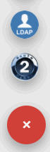

## Мои провайдеры

На вкладке **Мои провайдеры** отображаются созданные провайдеры. Данные провайдеры используются в приложениях для входа пользователей через виджет авторизации и являются интерфейсами для настройки взаимодействия с сервисом провайдера (сервера) при авторизации пользователя через приложение.  

В данный момент в сервисе авторизации Trusted.ID поддерживаются два типа провайдеров: LDAP, OAUTH2.
Все провайдеры пользователя выводятся в форме списка.

Для создания нового провайдера следует следует на вести курсор мыши на кнопку добавления (+) в правом нижнем углу формы и выбрать иконку с нужным типом провайдера. 

 

 Для редактирования настроек провайдера пользователю необходимо осуществить одиночный щелчок мышью по строке с обозначением провайдера.
 
 Для удаления провайдера или открытия формы с ограниченным набором его настроек можно воспользоваться меню действий, вызываемого по клику в правой части строки с наименованием провайдера.

 

## Основное окно настроек провайдера 

Основное окно настроек провайдера позволяет настраивать взаимодействие с сервисом провайдера путем заполнения специальных полей и регулировать возможность использования настроек провайдера в сторонних приложениях (не созданных пользователем).

***Примечание:*** далее рассматривается редактирование настроек на примере провайдера типа OAUTH2.

			
В верхней части окна расположена иконка смены картинки для провайдера. 
В блоке **Общие сведения** содержится уникальный идентификатор провайдера (с возможностью скопировать в буфер обмена), а также указывается наименование его владельца.

В блоке **Настройки приватности** пользователь определяет, будет ли данный провайдер доступен для использования при авторизации через приложения, создателем которых он не является. По умолчанию переключатель отвечающий за данную опцию находится в неактивном положении.

Поля в блоках **Авторизация провайдера**, **Получение code**, **Получение профиля пользователя** являются специализированными, а их значения служат для взаимодействия с сервисом провайдера. Для правильного заполнения полей служит блок с пояснениями в нижней части окна провайдера и иконки подсказок в правой части каждого из таких полей.

 
