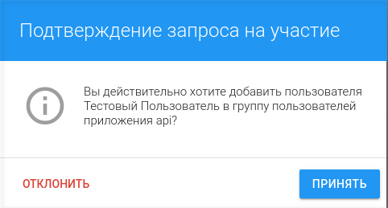

## Редактирование настроек приложения

Окно вызывается по щелчку мыши на значке редактирования приложения из основной формы его настроек, либо выбором пункта **Изменить** в контекстном меню приложения на вкладке **Мои приложения**.

 

Окно редактирования настроек приложения позволяет менять наименование приложения, его описание, изменять пароль и адреса сайта с контроллером авторизации, а также отключать пароль.

В поле **URL сайта** указывается адрес к сайту, на котором для авторизации пользователей используется данное приложение, а в поле **URL контроллера авторизации**  указывается адрес, на который будет переадресован браузер пользователя после прохождения им процедуры входа на сайт.

Поля **Время действия ключа восстановления** и **Время действия ключа доступа** являются специализированными. Данные поля заполнены значениями по-умолчанию.

Поле **Новый пароль** служит для смены пароля, заданного на этапе создания приложения, применяемого для защищенного обмена информацией между клиентом и сервером. Во избежание ошибок при введении пароля предусмотрено поле **Подтверждение пароля**.

Переключатель **Установить  пустой пароль** предоставляет возможность избежать установления пароля в данное приложение.

## Список пользователей и Список администраторов

Переход на данные формы осуществляется по клику на соответствующих значках в основном окне настроек приложения.

 

Данные формы предназначены для работы с администраторами приложения и для регулирования круга лиц, использующих приложение для авторизации на сайте.
Окно списка пользователей позволяет управлять ими в рамках четырех категорий. 

 - В категории **Запрос отправлен** отображаются пользователи, которым был выслан запрос на участие в приложении, но которые еще не дали свое согласие на включение их в круг активных.

- В категории **Запрос на участие** отражаются пользователи, направившие свой запрос на участие в приложении.

- В категории **Активные** отражены пользователи и группы, которые получили право пользования приложением.

- В категории **Заблокированные** находятся пользователи и группы, которым был запрещен доступ на авторизацию через данное приложение. 

Для просмотра всех пользователей и групп в каждой из категорий достаточно произвести одиночный клик по обозначению категории. В результате пользователю выводится список групп и пользователей принадлежащих данной категории, а также строка поиска, служащая для их фильтрации.  

Для перевода пользователя или группы в иную категорию используется контекстное меню действий.

Таким образом, владелец/администратор приложения может переводить пользователей и группы:

- из формы **Активные** в форму **Заблокированные** через пункт меню **Заблокировать**;

          
- из формы **Заблокированные** в форму **Активные** через пункт меню **Разблокировать**;

- из формы **Запрос на участие** в форму **Активные**  щелчком мыши по строке с именем пользователя (примечание: в случае отклонения администратором запроса пользователя, он исчезает из всех категорий).

Для добавления пользователей в категорию **Запрос отправлен** используются кнопки добавления пользователя/группы в правой нижней части окна, для вызова которых необходимо предварительно навести курсор мыши на кноку добавления (+). Добавить можно группу по ее названию, пользователя по его имени и идентификатору (email или телефон) .

Для удаления пользователей и групп используется пункт контекстного меню действий **Удалить** на формах **Активные** и **Заблокированные**, а также на форме **Запрос отправлен**.

         
Интерфейс работы с администраторами приложения идентичен интерфейсу работы с его пользователями за исключением того, что администратор не может самостоятельно отправить запрос на участие в приложении, а также администратора нельзя заблокировать.
