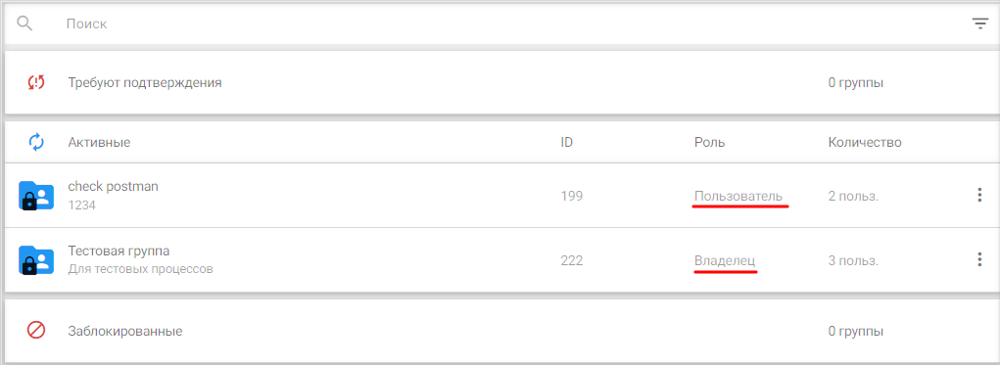
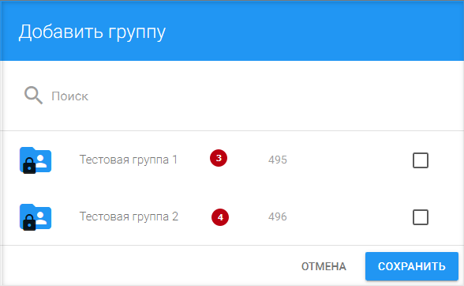
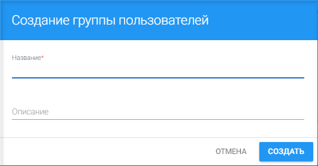
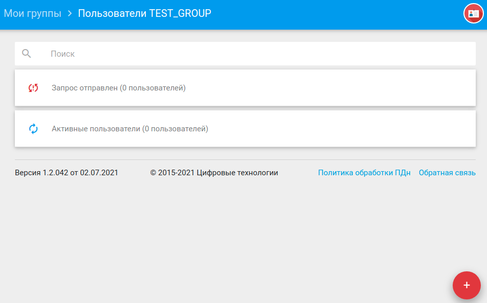
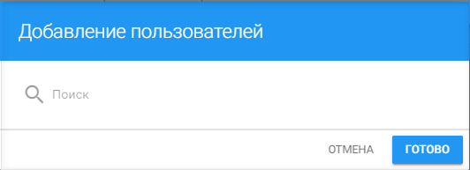
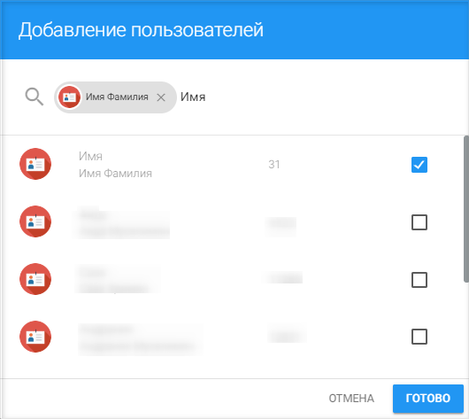

## Добавление пользователей и групп

В сервисе Trusted.ID группы делятся на две категории: 
- группы, где пользователь является владельцем;
- группы, в которых пользователь участвует как приглашенное лицо.

Созданные пользователем группы в дальнейшем используются  администраторами в приложениях и провайдерах. Таким образом, при попытке добавить группу в приложение, пользователь видит только те группы, создателем которых он является. 

Для создания группы пользователю нужно нажать кнопку добавления в правом нижнем углу окна со списком групп. 

Открывается форма добавления группы, где следует указать название группы и, при необходимости, ее описание.

Добавленная пользователем группа автоматически попадает в категорию **Активные**. 

Попытка перевода такой группы в категорию **Заблокированные** запрещена, т.к. блокировать группы имеет смысл лишь лицам, не желающим вступать в чужие группы, но не владельцам (создателям) групп.

Для добавления в созданную группу новых пользователей необходимо нажать на значок добавления в форме со списком пользователей группы.

Открывается форма поиска пользователей для добавления в группу. 

Для поиска пользователя достаточно начать вводить в поисковой строке имя.

Далее выбрать из результатов поиска нужного пользователя, установив в соответствующей строке флаг, и нажать кнопку **Готово**. Таким образом можно добавить сразу нескольких пользователей, активировав несколько флагов одновременно.

После того как пользователь будет добавлен в группу, он станет отображаться в категории **Запрос отправлен**. Если в дальнейшем приглашенный пользователь примет решение о вступлении в группу, то он будет перемещен в категорию **Активные пользователи**. В случае же, если он решит отклонить приглашение в группу, то такой пользователь исчезнет из списка пользователей группы.