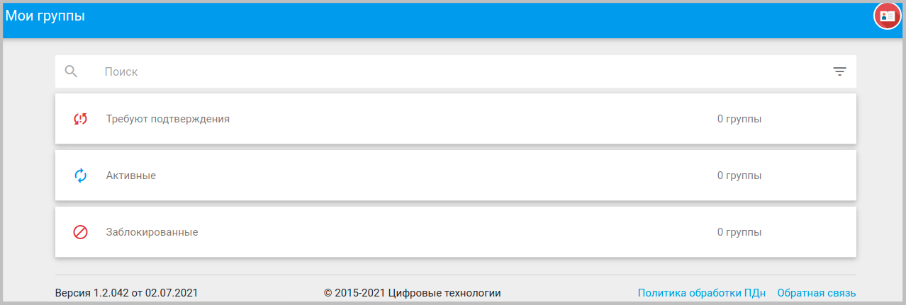
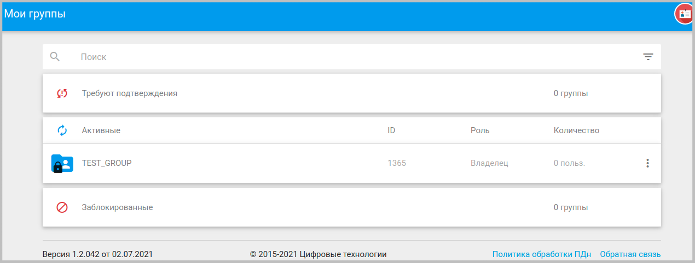
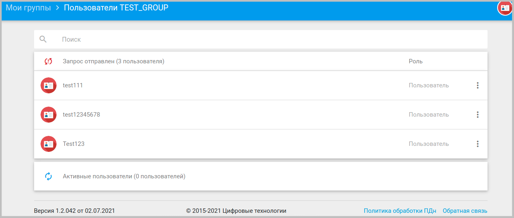

## Мои группы

В сервисе Trusted.ID группы являются удобным инструментом для регулирования круга лиц, которым разрешено пользоваться приложениями.

Со своей стороны пользователь сам определяет в какие группы он желает вступить либо, напротив, отказаться от участия в них. Администраторы приложений также могут быть определены в группы.

Наглядным примером удобства использования групп в сервисе может служить любое приложение с активированной опцией **Ограничить группой пользователей** в настройках. Если администратор такого приложения в какой-то момент решит запретить авторизацию определенным лицам, предварительно  объединенным в группу, то ему будет достаточно перевести группу в число заблокированных. После чего участники этой группы при попытке авторизации через данное приложение получат отказ.

Возврат группы в категорию **Активные** в форме пользователей приложения  вновь позволит ее участникам авторизовываться через приложение.

Интерфейс вкладки представлен в форме списка из трех категорий:
- Требуют подтверждения;
- Активные;
- Заблокированные.

В верхней части окна расположена поисковая строка для фильтрации групп по маске. В нижней части — кнопка создания новой группы.

Для просмотра групп, входящих в каждую из категорий, достаточно произвести одиночный клик по соответствующей группе.

Клик по названию группы в списке приводит к открытию формы со списком пользователей группы, разделенных на две подкатегории **Запрос отправлен** и **Активные пользователи**. Клик по любой из них раскрывает список пользователей .

В верхней части окна расположена поисковая строка для фильтрации пользователей по маске. В нижней части — кнопка поиска пользователей для добавления.
