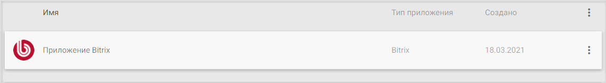
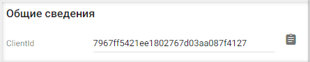
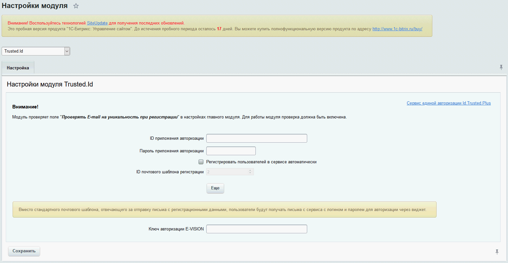
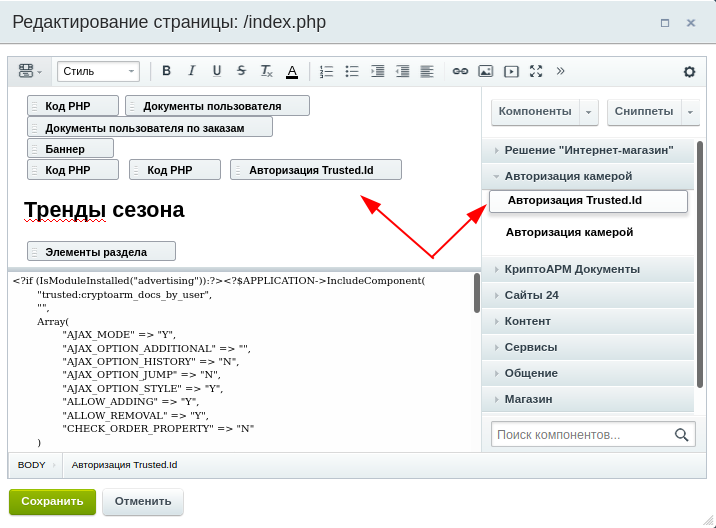
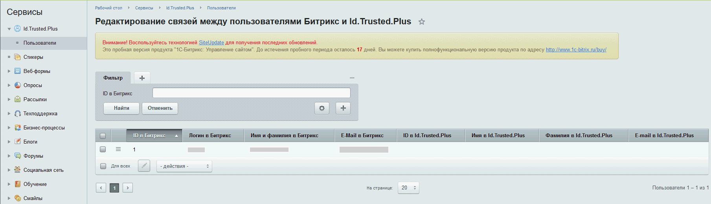
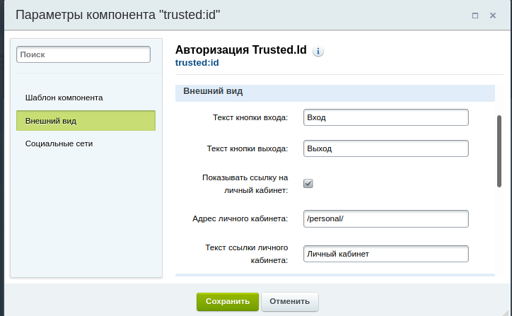

##  Шаг 1. Регистрация или авторизация в сервисе Trusted.ID 

Для установки и последующей работы с модулем Trusted.ID администратор сайта должен быть зарегистрирован и авторизован в сервисе, например [Trusted.ID](https://id.trusted.plus).

1. Для прохождения регистрации обратитесь к разделу **Регистрация**.
2. Авторизуйтесь в сервисе согласно разделу **Авторизация**. 
   
##  Шаг 2. Создание приложения типа Bitrix 

1. Для установки модуля авторизации необходимо создайте приложение типа Bitrix, для этого обратитесь к **Инструкции по созданию приложения** раздел **Создание приложения типа Bitrix**.
2. В списке на вкладке **Мои приложения** отобразится созданное приложение. 
   
   

3. Откройте настройки приложения, нажав на нем списке, и скопируйте ClientId из раздела **Общие сведения**.
   
   

4. Сохраните данный ключ. Он понадобится в дальнейшем при настройке модуля авторизации.

## Шаг 3. Установка модуля Trusted.ID на сайте Битрикс

***ВАЖНО​:*** для работы модуля авторизации требуется сервер с поддержкой протокола HTTPS и расширением "curl" для php. 

1. Загрузите и установите модуль Trusted.ID из маркетплейса https://marketplace.1c-bitrix.ru/solutions/trusted.id/.

## Шаг 4. Настройка параметров модуля Trusted.ID в административной части сайта Битрикс

1. Перейдите к странице настроек модуля в административной части интерфейса сайта: **​Администрирование — Настройки — Настройки модулей — Trusted.Id​**

    

2. Заполните поля:
   - **ID приложения авторизации** — это ClientId.
   - **Пароль приложения авторизации** — был введен при создании приложения типа **Bitrix** в сервисе.
   - **Регистрировать пользователей в сервисе автоматически** — установка флага позволит зарегистрироваться через виджет авторизации пользователям, не имеющим аккаунта на вашем сайте.
  
    Нажмите кнопку **Сохранить**. 

## Шаг 5. Добавление виджета авторизации в публичную часть сайта Битрикс

1. Перейдите в публичную часть сайта, где предполагается разместить виджет авторизации.
   
2. Выберите пункт административного меню **Изменить страницу**.

3. В разделе **Компоненты** открывшейся формы выберите компонент **Авторизация Trusted.Id**. 

    

4. Перетащите компонент на поле графического обозначения страниц. 

    

5. Нажмите **Сохранить** для добавления виджета авторизации.

6. После установки модуля авторизации в административной части сайта появится форма (​**Администрирование — Сервисы — Id.Trusted.Plus — Пользователи​**) для управления пользователями, авторизованными, в том числе, посредством сервиса Trusted.ID.
В данной форме вы можете редактировать записи пользователей, регистрировать и отменять их связь с сервисом Trusted.ID, а также производить другие действия. 

    
   
## Шаг 6. Настройка компонента авторизации 

1. Осуществите двойной клик по обозначению компонента **Авторизация Trusted.Id** на странице редактирования.
 
   

3. Настройте необходимые параметры виджета авторизации.

4. Нажмите на кнопку **Сохранить** в окне параметров компонента и в форме редактирования страницы для фиксации изменений. 

