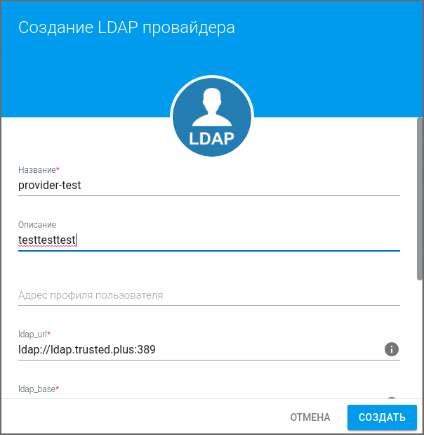
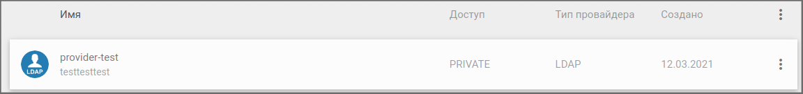
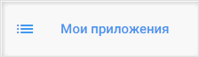
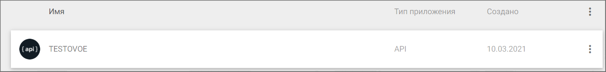
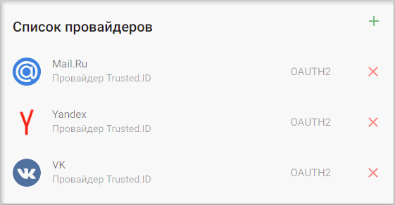
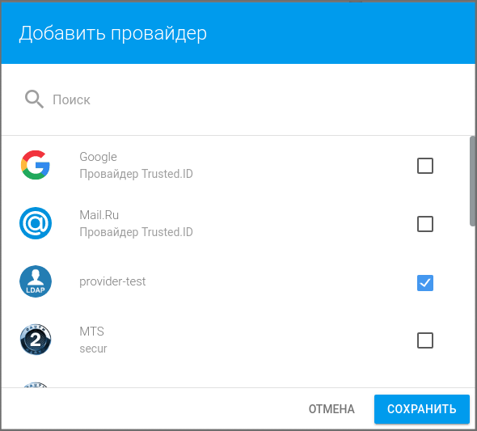
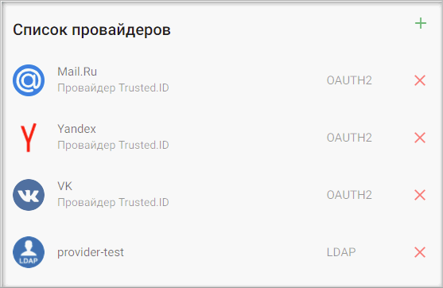
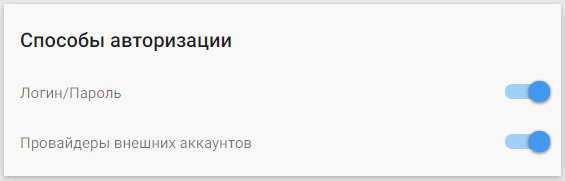
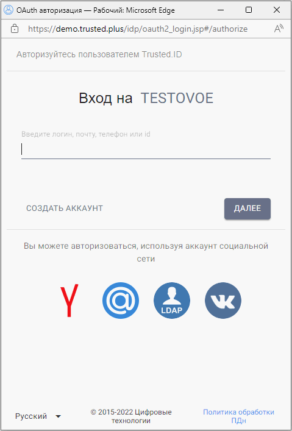

## Создание LDAP провайдера и подключение в приложение для авторизации через провайдер

Провайдер LDAP предназначен для авторизации пользователя через настроенный Active Directory.

Что такое Active Directory?

***Active Directory*** — служба каталогов корпорации Microsoft, предназначеная для хранения и организации объектов в сети в иерархическую защищенную логическую структуру, например пользователей, компьютеров или других физических ресурсов. 

Более подробно можно ознакомиться с следующих источниках:
* [Википедия](https://ru.wikipedia.org/wiki/Active_Directory)
* [1cloud](https://1cloud.ru/help/windows/struktura-hranilischa-active-directory)
----

## Предварительные шаги

1. Зарегистрируйтесь и/или авторизуйтесь на сервисе [Trusted.ID](https://id.trusted.plus). Для прохождения обратитесь к разделу **Регистрация** или **Авторизация**.
2. Создайте приложение. Процесс создания приложения описан в **Инструкции по созданию приложения**.
   
##  Шаг 1. Создание провайдера типа LDAP

1. Выберите раздел **Мои провайдеры** в навигационой панели в личном кабинете.
   
   
   
2. Наведите курсор на кнопку добавление нового провайдера в правом нижнем углу.
   
   

3. В списке провайдеров выберете **LDAP**.
   
   

4. В открывшейся форме укажите:
   - название LDAP-провайдера;
   - адрес сервера LDAP (поле ldap_url);
   - контекст учетных записей LDAP (поле ldap_base);
   - имя домена LDAP (поле ldap_domain).

    При необходимости заполните поля:
    - описание провайдера;
    - адрес профиля пользователя;
    - фильтр поиска учетной записи (поле ldap_filter);
    - список сопоставления атрибутов LDAP (поле ldap_mapping).

    Нажмите кнопку **Создать**.

    
   
5. Провайдер появляется в списке провайдеров:

    
----
##  Шаг 2. Добавление созданного LDAP провайдера в приложение
   
1.  Выберите раздел **Мои приложения** в навигационой панели в личном кабинете.
   
      

2. В списке приложений выберите приложение, в котором будет авторизация по LDAP провайдеру.
   
      

3. В открывшемся окне настроек приложения в разделе **Список провайдеров** нажмите кнопку добавления нового провайдера.
     
   
       

4. Установите флаг напротив созданного провайдера в списке доступных провайдеров и нажмите кнопку **Сохранить**.
   
       

5. Список провайдеров приложения обновится, и в нем отразится добавленный провайдер.

      

6. В разделе **Способы авторизации** убедитесь, что переключатель **Провайдеры внешних аккаунтов** включен.

      

7. Теперь авторизация в приложение доступна через LDAP провайдер.
     
      

##   Шаг 3. Добавление аккаунта LDAP провайдера в профиль пользователя

Добавить аккаунт LDAP провайдера в профиль пользователя можно несколькими способами:

1. Через личный кабинет в разделе **Мой профиль**, блок **Внешние аккаунты**.
   
2. Через виджет авторизации, используя **Авторизацию  через социальные сети**. Процесс описан в разделе **Регистрация**.
   
3. Через виджет авторизации, используя **Регистрацию через социальные сети**. Процесс описан в разделе **Авторизация**.