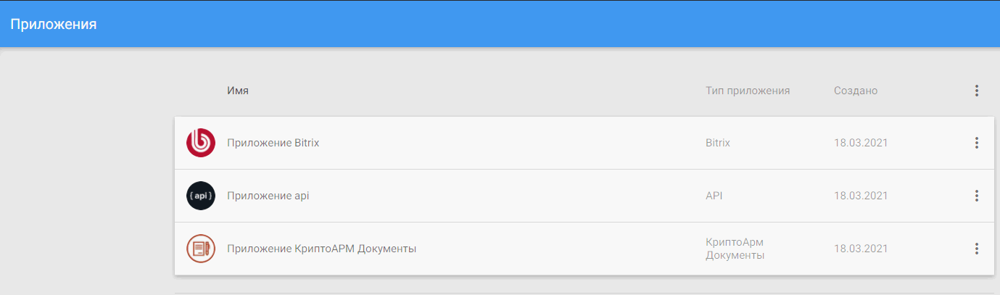

## Шаг 1. Авторизация или регистрация на сервисе

Для создания приложения администратор должен быть зарегистрирован и авторизован в сервисе, например [Trusted.ID](https://id.trusted.plus).

1. Для прохождения регистрации обратитесь к разделу **Регистрация**.
2. Авторизуйтесь в сервисе согласно разделу **Авторизация**. 

## Шаг 2. Создание приложения

1. Перейдите на вкладку **Мои приложения** в личном кабинете через навигационную панель.

    

2. Нажмите на кнопку для добавления нового приложения 
   
    
   
   и выберите необходимый тип приложения:
   - КриптоАРМ Документы;
   - API;
   - BITRIX. 
  
   

3. Заполните поля и нажмите кнопку **Сохранить**.

    

Поля на форме создания для разных типов приложений отличаются и описаны ниже.

4. Созданное приложение появляется в списке приложений.
   
   
 
## Описание полей приложения типа КриптоАРМ Документы

 - **Название** — название приложения;
 - **Описание** — описание приложения;
 - **URL сайта** — указывается адрес сайта, на котором для авторизации пользователей используется данное приложение;
 - **Установить  пустой пароль** — предоставляет возможность избежать установления пароля в данное приложение;
 - **Пароль** и **Подтверждение пароля** — пароль, применяемый для защищенного обмена информацией между клиентом и сервером.

## Описание полей приложения типа API

 - **Название** — название приложения;
 - **Описание** — описание приложения;
 - **URL сайта** — указывается адрес сайта, на котором для авторизации пользователей используется данное приложение;
 - **URL контроллера авторизации**  — указывается адрес, на который будет переадресован браузер пользователя после прохождения им процедуры входа на сайт;
 - **Время действия ключа восстановления** и **Время действия ключа доступа** - являются специализированными;
 - **Установить  пустой пароль** — предоставляет возможность избежать установления пароля в данное приложение;
 - **Пароль** и **Подтверждение пароля** — пароль, применяемый для защищенного обмена информацией между клиентом и сервером.

## Описание полей приложения типа BITRIX

 - **Название** — название приложения;
 - **Описание** — описание приложения;
 - **URL сайта** — указывается адрес сайта, на котором для авторизации пользователей используется данное приложение;
 - **Установить  пустой пароль** — предоставляет возможность избежать установления пароля в данное приложение;
 - **Пароль** и **Подтверждение пароля** — пароль, применяемый для защищенного обмена информацией между клиентом и сервером.

