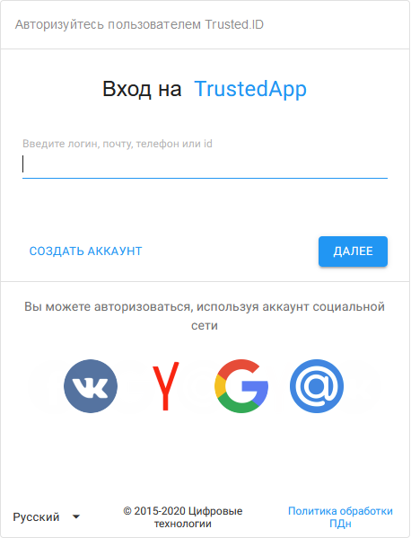
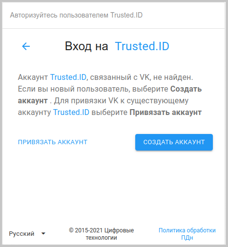

Авторизоваться в сервисе можно по логину/паролю или через социальные сети.

*Trusted.ID — название сервиса.* 
*TrustedApp — название приложения.* 

# Авторизация по логину/паролю

При авторизации по логину/паролю виджет разделен на две формы — ввод идентификационных данных и ввод пароля авторизации. 

В первой форме нужно ввести идентификатор и нажать **Далее**. 

В качестве идентификатора может использоваться:

●	логин;

●	электронная почта, заранее прикрепленная к профилю;

●	номер телефона, заранее прикрепленный к профилю;

●	id, указанный в профиле пользователя.

Открывается вторая форма виджета, где отображается аватарка и введенный идентификатор пользователя, а также поле для ввода пароля. 
 
")

После ввода пароля и нажатия на кнопку **Войти** происходит вход в **Личный кабинет** пользователя.

# Авторизация через социальные сети 

Для авторизации через социальные сети нужно выбрать необходимую социальную сеть. 

***Примечание:*** далее рассматривается авторизация с помощью социальной сети Google.

После выбора социальной сети необходимо авторизоваться в ней под своим логином и паролем. Если аккаунт социальной сети прикреплен к профилю пользователя, то автоматически происходит авторизация в профиле. 

Если аккаунт в социальной сети не прикреплен ни к одному из профилей, открывается форма выбора действия. 

 

Если у пользователя есть зарегистрированный профиль в сервисе, то можно привязать аккаунт к данному профилю, нажав на **Привязать аккаунт**.  

Открывается поле ввода идентификатора с последующем вводом пароля. 

 

После прохождения авторизации открывается профиль с привязанным аккаунтом социальной сети в разделе **Внешние аккаунты**. 

Если у пользователя нет профиля в сервисе, в форме выбора действий можно создать аккаунт, нажав кнопку **Создать аккаунт**. 

Происходит переход на виджет регистрации. Процесс регистрации описан в разделе [**Регистрация нового пользователя**](https://docs.trusted.plus/03-v1.3/2-authorization/registration). 

# Смена профиля

Для смены аккаунта нужно кликнуть мышью на идентификатор пользователя. При наведении на идентификатор отображается подсказка **Сменить учетную запись**.  

Происходит переход на страницу выбора необходимого профиля. 

Можно выбрать аккаунт из ранее сохраненных или нажать **Сменить аккаунт**.

Открывается виждет авторизации для ввода данных другого пользователя.

")

# Восстановление пароля

Для восстановления пароля есть 2 варианта.

**1-й вариант**.  

В форме авторизации на уровне введения идентификатора нужно начать вводить свой идентификатор, при появлении надписи **Не можете войти?** нужно нажать на нее и выбрать в открывшемся меню **Восстановить пароль**. 

**2-й вариант.**  

После введения идентификатора и прохождения на форму введения пароля нужно начать вводить сиволы пароля, при появлении надписи **Не можете войти?** нужно нажать на нее.

")

В открывшемся списке нужно выбрать **Восстановить пароль**.

")

В открывшемся виджете необходимо ввести телефон или адрес электронной почты, которые прикреплены к профилю.

  

На указанный идентификатор (телефон или адрес электронной почты) придет проверочный код, который нужно ввести в поле ввода. 

 
Если проверочный код не был введен в положенное время или он не пришел, то есть возможность запросить код повторно. 

В открывшемся окне нужно заполнить новый пароль и его подтверждение. 

 После успешной смены пароля происходит автоматический переход в профиль.

# Сброс пароля 

При авторизации через провайдер LDAP для пользователей предусмотрен сброс пароля.

Для этого на форме авторизации нужно выбрать авторизацию через LDAP.

Открывается форма ввода авторизационных данных пользователя в Active Directory (AD).

Для сброса пароля нужно нажать **Сбросить пароль**. Открывается форма ввода логина Active Directory.

Необходимо ввести логин и нажать **Сбросить пароль**. 

После успешной проверки пользователя в Active Directory, открывается форма ввода проверочного кода, который приходит на привязанную электронную почту, и задания нового пароля. 

При нажатии на кнопку **Войти** происходит вход в приложение.

# Блокировка входа пользователя 

При вводе пароля неправильно более N раз подряд с одного IP-адреса вход пользователя на сервис блокируется с этого IP-адреса.

В виджете авторизации отображается ошибка.

Количество доступных попыток авторизации и время блокировки в минутах задаются в конфигурационном файле системы. По умолчанию задано 5 попыток ввода пароля и 15 минут блокировки.

Вход через социальные сети или с другого IP-адреса возможен.
