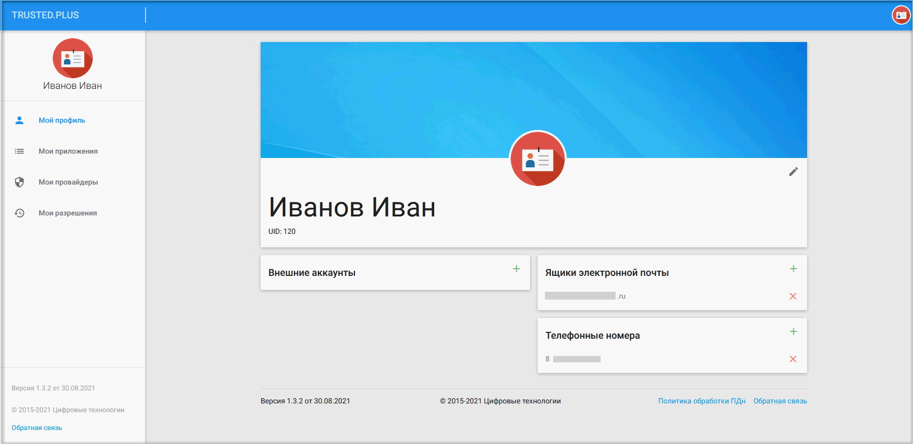
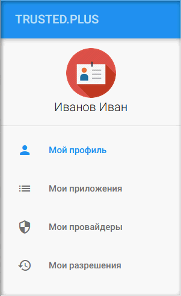
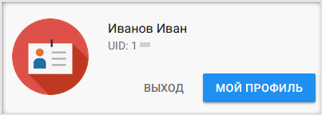
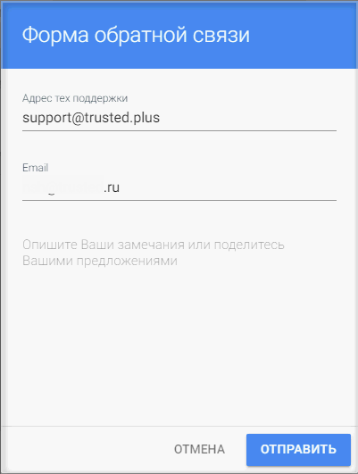

## Личный кабинет пользователя

После авторизации или регистрации открывается личный кабинет на вкладке профиля пользователя. 

В личном кабинете пользователь может редактровать профиль, настраивать приложения и провайдеры, управлять своими разрешениями.

Переход на вкладки осуществляетмя через навигационную панель:    
- Мой профиль;
- Мои приложения;
- Мои провайдеры;
- Мои разрешения.

 
На каждой вкладке в правом верхнем углу расположена иконка с автаркой пользователя, при нажатии на которую отображается окно с краткой информацией о пользователе, кнопки быстрого перехода на вкладку **Мой профиль** и **Выход**.               
    
 

                

При нажатии на ссылку **Обратная связь** открывается форма ввода обращения в техническую поддержку.

При нажатии на **Политика обработки ПДн** открывается документ для ознакомления с политикой обработки персональных данных.