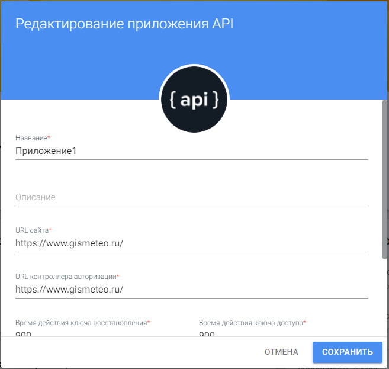
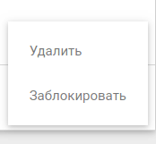
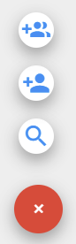

## Редактирование настроек приложения

На форме редактирования настроек приложения можно изменить название приложения, описание, пароль и URL адреса сайта с контроллером авторизации.

Окно вызывается по щелчку мыши на значке редактирования приложения из основной формы его настроек или выбором пункта **Изменить** в контекстном меню приложения на вкладке **Мои приложения**.

 

В поле **URL сайта** указывается адрес сайта, на котором используется авторизация.

В поле **URL контроллера авторизации** —  URL страницы, на которую попадет пользователь после того, как разрешит авторизацию на сайте.

Поля **Время действия ключа восстановления** и **Время действия ключа доступа** являются специализированными, в данной версии приложения не используются.

Переключатель **Установить  пустой пароль** предоставляет возможность избежать установления пароля в данное приложение.  

Поле **Новый пароль** служит для смены пароля, заданного на этапе создания приложения.  Во избежание ошибок при введении пароля предусмотрено поле **Подтверждение пароля**.

## Список пользователей и Список администраторов

Предназначены для работы с администраторами приложения и для регулирования круга лиц, которым предоставлен доступ к информационной системе.

Переход к спискам администраторов и пользователей осуществляется по клику на соответствующих значках в основном окне настроек приложения.

 

 - В категории **Запрос отправлен** отображаются пользователи, которым был выслан запрос на участие в приложении, но которые еще не дали свое согласие на включение их в круг активных.

- В категории **Запрос на участие** отражаются пользователи, направившие свой запрос на участие в приложении.

- В категории **Активные** отражены пользователи и группы, которые получили право пользования приложением.

- В категории **Заблокированные** находятся пользователи и группы, которым был запрещен доступ на авторизацию в информационную систему. 

Для просмотра пользователей и групп в каждой категории нужно кликнуть по категории.   

В результате пользователю выводится список групп и пользователей, принадлежащих данной категории, а также строка поиска, служащая для их фильтрации.  

Для перевода пользователя или группы в другую категорию используется контекстное меню действий.

Таким образом, владелец/администратор приложения может переводить пользователей и группы:

- из формы **Активные** в форму **Заблокированные** через пункт меню **Заблокировать**;

          
- из формы **Заблокированные** в форму **Активные** через пункт меню **Разблокировать**;

- из формы **Запрос на участие** в форму **Активные**  щелчком мыши по строке с именем пользователя.

***Примечание:*** в случае отклонения администратором запроса пользователя он исчезает из всех категорий.

Для добавления пользователей в категорию **Запрос отправлен** используются кнопки добавления пользователя/группы. 

 

Добавить группу можно по ее названию, пользователя — по его имени и идентификатору (email или телефон) .

Для удаления пользователей и групп используется пункт контекстного меню действий **Удалить** на формах **Активные** и **Заблокированные**, а также на форме **Запрос отправлен**.

         
Интерфейс работы с администраторами приложения идентичен интерфейсу работы с его пользователями за исключением того, что администратор не может самостоятельно отправить запрос на участие в приложении, а также администратора нельзя заблокировать.
