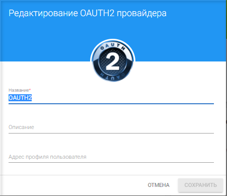

## Редактирование описания провайдера

Окно редактирования названия провайдера открывается по нажатию иконки редактирования.

В открывшемся окне можно изменить название провайдера, описание и адрес профиля пользователя.

## Редактирование настроек провайдера

Данная форма вызывается с вкладки **Мои провайдеры** через пункт контекстного меню **Изменить**. 

Форма содержит некоторые поля основного окна настроек и поля формы редактирования названия провайдера. 

