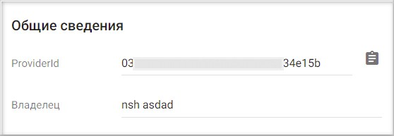

## Настройка провайдера для авторизации через Facebook

1. Зарегистрируйтесь и/или авторизуйтесь на сервисе, где развернута система Trusted Net (далее рассматривается сервис [TRUSTED.PLUS](https://id.trusted.plus)).  
2. Создайте провайдер типа OAuth2.0.   
3. Зарегистрируйтесь/авторизуйтесь в [Facebook](https://www.facebook.com/).  
4. Перейдите на страницу добавления приложения https://developers.facebook.com.   
5. Авторизуйтесь как разработчик.  
6. Выберите тип приложения (Потребительское) и нажмите **Далее**.  
   
   
   
7.  Напишите любое название и свой email-адрес. Нажмите на **Создание приложения**.  
   
        

8. В разделе **Товары** - **Добавить товар** выберите **Вход через Facebook** - **Настроить**.
   
     

9.  В мастере настройки перейдите в раздел **Товары** - **Вход через Facebook** → **Настройки**.  

        

10. Включите **Клиентская авторизация OAuth**.  

      
 
11. В поле **Действительные URI перенаправления для OAuth** введите URL вида
https://id.trusted.plus/idp/sso/authorize?provider_id=88b3361b2f480ce2&auth_type=OAUTH2,
      где provider_id - это значение поля ProviderId в настройках созданного провайдера OAuth2.0 на сервисе.        
        
      
      Замените домен на домен своего сайта.  
      Сохраните изменения.  

11. Перейдите в раздел **Настройки** - **Основное**.  
    
      

12. В поле **URL-адрес политики конфиденциальности** введите адрес домена. В поле **Удаление данных пользователей** введите адрес к инструкции по удалению данных.  Сохраните изменения.

        
 
11. Cкопируйте **ID приложения** и **Секрет приложения**.
   
12. Перейдите в настройки провайдера OAuth2.0 на сервисе Trusted.  
    
      

15. Вставьте скопированные значения **ID приложения** и **Секрет приложения** в соответствующие поля в настройках провайдера  и нажмите **Сохранить**.  
    
      

16. В настройках провайдера установите:   
      - user_authorization_uri -https://www.facebook.com/dialog/oauth  
      - scope - email  
      - access_token_uri - https://graph.facebook.com/oauth/access_token  
      - fields - id, email, first_name, last_name, picture.type(large)   
      - user_info_uri - https://graph.facebook.com/me  

      Сохраните изменения.    
        
 
13. В настройках провайдера установите флаг **Настройки приватности** как **Публичный**, если хотите, чтобы данный провайдер был доступен всем при настройке авторизации в приложение.  
    
       

##  Добавление созданного Facebook провайдера в приложение
   
1.  Выберите раздел **Мои приложения** в личном кабинете.
   
      

2. В списке приложений выберите приложение, в которое будет добавлена авторизация через Facebook провайдер.
   
      

3. В открывшемся окне настроек приложения в разделе **Список провайдеров** нажмите кнопку добавления нового провайдера . 
   
       

4. Установить флаг напротив созданного провайдера в списке доступных провайдеров и нажмите кнопку **Сохранить**.
   
       

5. Список провайдеров приложения обновиться и в нем отразится добавленный провайдер.

      

6. В разделе **Способы авторизации** убедитесь, что переключатель **Провайдеры внешних аккаунтов** включен.

      

7. Теперь авторизация в приложение доступна через провайдер Facebook.
     
      

**ИНСТРУКЦИИ ПО ТЕМЕ:**  

1. [Инструкция по созданию приложения.](https://docs.trusted.plus/03-v1.3/8-instructions/create-app)  
2. [Как создать провайдер.](https://docs.trusted.plus/03-v1.3/5-providers/providers)  