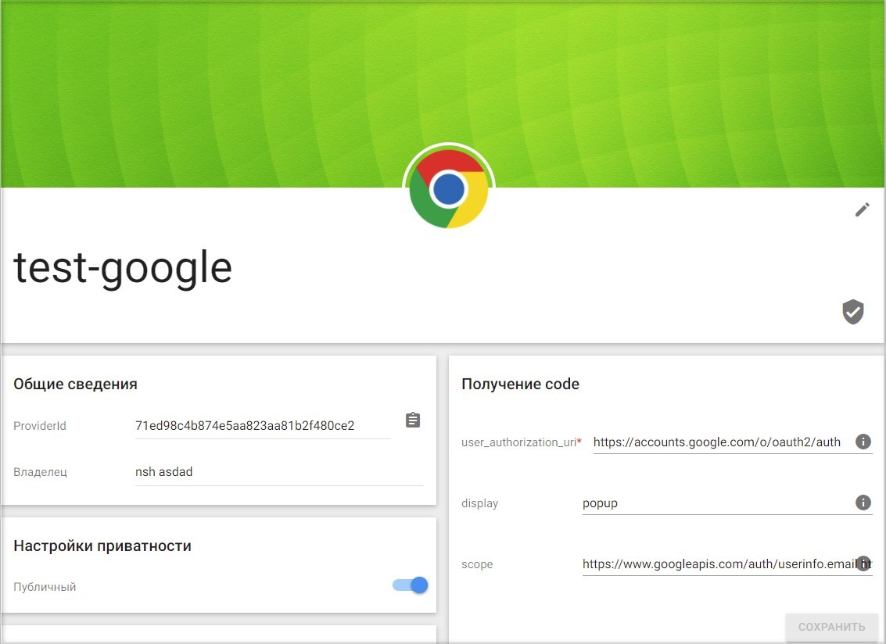

## Настройка провайдера для авторизации через Google

1. Зарегистрируйтесь и/или авторизуйтесь на сервисе, где развернута система Trusted Net (далее рассматривается сервис [TRUSTED.PLUS](https://id.trusted.plus)).  
2. Создайте провайдер типа OAuth2.0.  
3. Зарегистрируйтесь/авторизуйтесь в [Google](https://accounts.google.com/signin/v2/identifier?hl=ru&passive=true&continue=https%3A%2F%2Fwww.google.ru%2F&ec=GAZAmgQ&flowName=GlifWebSignIn&flowEntry=ServiceLogin).  
4. Откройте страницу https://code.google.com/apis/console#access.    
5. Создайте новый проект кнопкой **Создать проект**.  
   
     

6. Введите любое название и нажмите **Создать**.  
7. Перейдите к настройкам созданного проекта.  
   
     

8. Откройте раздел **API и сервисы** - **Окно запроса доступа OAuth**.  
   
     

9.  Выберите **User Type** - "Внешний" и нажмите **Создать**  
    
      

10. Введите название приложения. 
    
      

11. Внизу страницы введите доменное имя своего сайта в поле **Авторизованные домены**. 
    
      

    Сохраните настройки.   
12. Откройте раздел **API и сервисы** - **Учетные данные** в настройках проекта Google. 
    
      

13. Нажмите **Создать учётные данные** и выберите **Идентификатор клиента OAuth**. 
    
      

14. Выберите тип приложения **Веб-приложение**. 
    
      

15. В поле **Разрешенные URI перенаправления** вставьте строку типа  
https://domain.ru/idp/sso/authorize?provider_id=ddfc59194e5085a88b3361b2f480ce2&auth_type=OAUTH2,
      где provider_id - это значение поля ProviderId в настройках созданного провайдера OAuth2.0 на сервисе Trusted.  

         

      Замените domain.ru на домен своего сайта.

16. На форме редактирования **Клиента OAuth** скопируйте **Идентификатор клиента** и **Секрет клиента**. 
    
      

17. Перейдите в настройки провайдера OAuth2.0 на сервисе Trusted.  
    
      

18. Вставьте скопированные значения в соответствующие поля в настройках провайдера  и нажмите **Сохранить**.  
    
      

19. В настройках провайдера установите флаг **Настройки приватности** как **Публичный**, если хотите, чтобы данный провайдер был доступен всем при настройке авторизации в приложение.  
    
      

##  Добавление созданного Google провайдера в приложение
   
1.  Выберите раздел **Мои приложения** в личном кабинете.
   
      

2. В списке приложений выберите приложение, в которое будет добавлена авторизация через Google провайдер.
   
      

3. В открывшемся окне настроек приложения в разделе **Список провайдеров** нажмите кнопку добавления нового провайдера . 
   
       

4. Установить флаг напротив созданного провайдера в списке доступных провайдеров и нажмите кнопку **Сохранить**.
   
       

5. Список провайдеров приложения обновиться и в нем отразится добавленный провайдер.

      

6. В разделе **Способы авторизации** убедитесь, что переключатель **Провайдеры внешних аккаунтов** включен.

      

7. Теперь авторизация в приложение доступна через провайдер Google.
     
      

**ИНСТРУКЦИИ ПО ТЕМЕ:**  

1. [Инструкция по созданию приложения.](https://docs.trusted.plus/03-v1.3/8-instructions/create-app)  
2. [Как создать провайдер.](https://docs.trusted.plus/03-v1.3/5-providers/providers)  