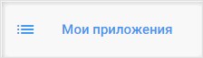

## Настройка провайдера для авторизации через Mail

1. Зарегистрируйтесь и/или авторизуйтесь на сервисе, где развернута система Trusted.Net (далее рассматривается сервис [Trusted.ID](https://id.trusted.plus)).  
2. Создайте провайдер типа OAuth2.0.  
3. Зарегистрируйтесь/авторизуйтесь в [Mail.ru](https://mail.ru/).  
4. Перейдите на страницу добавления приложения https://api.mail.ru/sites/my/add, согласившись с **Правилами использования**.  
       
   

5. Напишите любое название приложения и URL главной страницы вашего сайта.  
   Нажмите **Продолжить**.

   

6. Пропустите следующий шаг по загрузке файла receiver.html.   
7. Скопируйте значения **ID** и **Секретный ключ**.  
   
      

8.  Перейдите в настройки провайдера OAuth2.0 на сервисе.  
    
      

14. Вставьте скопированные значения в соответствующие поля в настройках провайдера  и нажмите **Сохранить**.  
    
      

15. В настройках провайдера установите:  
    - user_authorization_uri - https://connect.mail.ru/oauth/authorize  
    - access_token_uri - https://connect.mail.ru/oauth/token  
    - fields - users.getInfo
    - user_info_uri - http://www.appsmail.ru/platform/api     
  
    
 
	**Сохраните** изменения.  

20. В настройках провайдера установите флаг **Настройки приватности** как **Публичный**, если хотите, чтобы данный провайдер был доступен всем при настройке авторизации в приложение.  
    
        

##  Добавление созданного Mail провайдера в приложение
   
1.  Выберите раздел **Мои приложения** в личном кабинете.
   
      

2. В списке приложений выберите приложение, в которое будет добавлена авторизация через Mail провайдер.
   
      

3. В открывшемся окне настроек приложения в разделе **Список провайдеров** нажмите кнопку добавления нового провайдера.
     
   
       

4. Установите флаг напротив созданного провайдера в списке доступных провайдеров и нажмите кнопку **Сохранить**.
   
       

5. Список провайдеров приложения обновится, и в нем отразится добавленный провайдер.

      

6. В разделе **Способы авторизации** убедитесь, что переключатель **Провайдеры внешних аккаунтов** включен.

      

7. Теперь авторизация в приложение доступна через провайдер Mail.ru.
     
      

**ИНСТРУКЦИИ ПО ТЕМЕ:**  

1. [Инструкция по созданию приложения.](https://docs.trusted.plus/03-v1.3/8-instructions/create-app)  
2. [Как создать провайдер.](https://docs.trusted.plus/03-v1.3/5-providers/providers)  