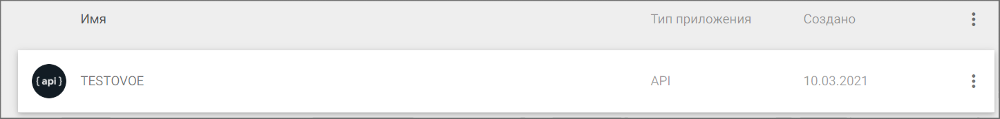
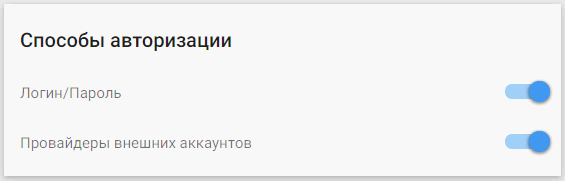

## Настройка провайдера для авторизации через VK

1. Зарегистрируйтесь и/или авторизуйтесь на сервисе, где развернута система Trusted.Net (далее рассматривается сервис [Trusted.ID](https://id.trusted.plus)).  
2. Создайте провайдер типа OAuth2.0.  
3. Зарегистрируйтесь/авторизуйтесь в [ВКонтакте](https://vk.com/).  
4. Перейдите на страницу добавления приложения https://vk.com/editapp?act=create.    
     
5. Напишите любое название, например, домен вашего сайта.  
6. Выберите платформу **Cайт**.  
7. Напишите адрес своего сайта и отдельно только его домен — без указания протокола.   
8. Нажмите **Подключить сайт**.  
   
9.  Перейдите в раздел **Настройки** на форме редактирования приложения.
    
      

10. Скопируйте значения **ID приложения** и **Защищенный ключ**.
 
11. Перейдите в настройки провайдера OAuth2.0 на сервисе.  
    
      

12. Вставьте скопированные значения в соответствующие поля в настройках провайдера  и нажмите **Сохранить**.  
    
      

13. В настройках провайдера установите:  
    - user_authorization_uri - https://oauth.vk.com/authorize  
    - scope - offline,email  
    - access_token_uri - https://oauth.vk.com/access_token  
    - user_info_uri - https://api.vk.com/method/getProfiles?v=5.92     
  
    
 
	**Сохраните** изменения.  

20. В настройках провайдера установите флаг **Настройки приватности** как **Публичный**, если хотите, чтобы данный провайдер был доступен всем при настройке авторизации в приложение.  
    
        

##  Добавление созданного VK провайдера в приложение
   
1.  Выберите раздел **Мои приложения** в личном кабинете.
   
      

2. В списке приложений выберите приложение, в которое будет добавлена авторизация через VK провайдер.
   
      

3. В открывшемся окне настроек приложения в разделе **Список провайдеров** нажмите кнопку добавления нового провайдера.
     
   
       

4. Установите флаг напротив созданного провайдера в списке доступных провайдеров и нажмите кнопку **Сохранить**.
   
       

5. Список провайдеров приложения обновится, и в нем отразится добавленный провайдер.

      

6. В разделе **Способы авторизации** убедитесь, что переключатель **Провайдеры внешних аккаунтов** включен.

      

7. Теперь авторизация в приложение доступна через провайдер VK.
     
      

**ИНСТРУКЦИИ ПО ТЕМЕ:**  

1. [Инструкция по созданию приложения.](https://docs.trusted.plus/03-v1.3/8-instructions/create-app)  
2. [Как создать провайдер.](https://docs.trusted.plus/03-v1.3/5-providers/providers)  