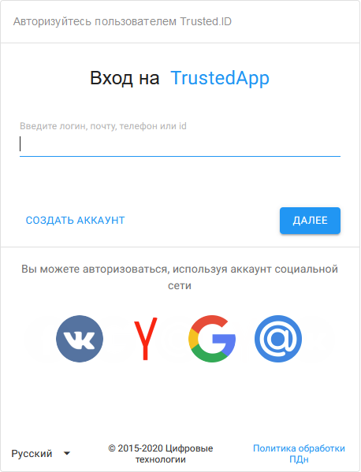
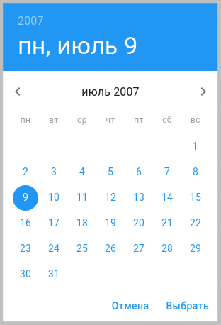
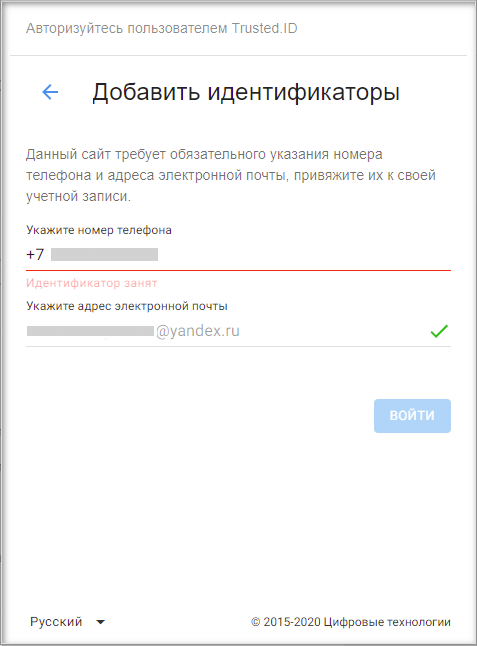
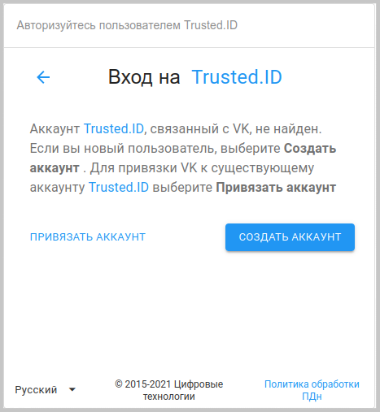

Для использования сервиса в полном объеме необходимо пройти регистрацию пользователя.  
После перехода на главную страницу открывается виджет авторизации.

 

Регистрация возможна напрямую по кнопке **Создать аккаунт** или через социальные сети.

# Регистрация пользователя 

Для создания нового пользователя необходимо в виджете авторизации нажать на **Создать аккаунт**. 

Открывается окно cоздания аккаунта.

") 

В форме представлены следующие обязательные поля:

- **Укажите ваше имя** — имя, по которому сервис будет обращаться к пользователю.
- **Придумайте логин**. Логин должен быть уникальным для сервиса, в дальнейшем с его помощью можно авторизовываться.  Логин пользователя может включать латинские буквы (a-z), цифры (0-9) и точку (.), без подчеркивания, минимум 3 символа, максимум 30. Одно слово или разделено точкой. 
- **Дата рождения**. Минимальным возрастом для управления аккаунтом считается 14 лет. Можно ввести дату с клавиатуры или **воспользоваться календарем:** 
  

  

- **Пароль и его подтверждение**. Минимальное количество символов 8, максимальное — 32.
- **Согласие на обработку персональных данных** — установка флага подтверждает согласие на обработку. Для ознакомления с  политикой обработки персональных данных на сервисе нужно кликнуть мышью на выделенную цветом часть надписи.

После заполнения всех полей становится активна кнопка **Создать аккаунт** или **Далее** в зависимости от настроек авторизации в приложении.  

Если в настройках приложения стоит обязательность наличия номера телефона и/или email, то при нажатии на кнопку **Далее** открывается 2-я форма виджета регистрации для добавления требуемых идентификаторов.

")

Запрашиваться могут оба идентификатора или любой из них в зависимости от настройки приложения. 

После введения номера/email происходит проверка на уникальность данного идентификатора с помощью sms/письма c проверочным кодом. Если эти данные используются в сервисе для другого пользователя, то появится информационное сообщение **Идентификатор занят**.

 

Если в настройках приложения не указана обязательность наличия номера телефона и email, то этот шаг пропускается, на форме ввода данных пользователя отображается кнопка **Создать аккаунт**.

После успешной регистрации происходит вход в **Личный кабинет** пользователя без повторной авторизации. 

# Регистрация пользователя через социальные сети

В форме авторизации необходимо выбрать социальную сеть для авторизации. 

Когда аккаунт в социальной сети не прикреплен ни к одному из профилей, открывается форма выбора действия, в которой можно создать аккаунт по кнопке **Создать аккаунт**. 

 

После перехода на виджет регистрации, нужно пройти регистрацию, описанную в разделе **Регистрация пользователя**. 

# Авторегистрация пользователя через провайдер LDAP

Авторегистрация пользователя возможна при одновременном выполнении следующих условий:  
- у приложения подключен один провайдер LDAP;  
- у приложения настроена авторицация через внешний провайдер.  

При авторизации через провайдер LDAP, если в сервисе не найден пользователь с такими идентификационными данными, то происходит автоматическая регистрация этого пользователя.

