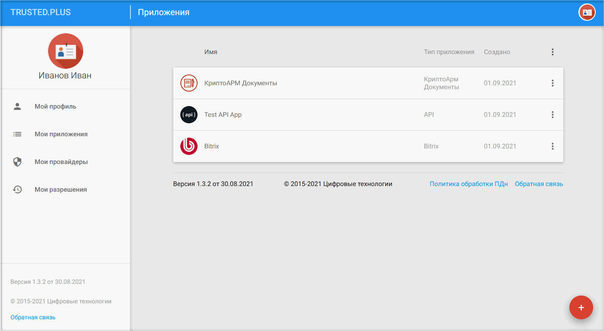
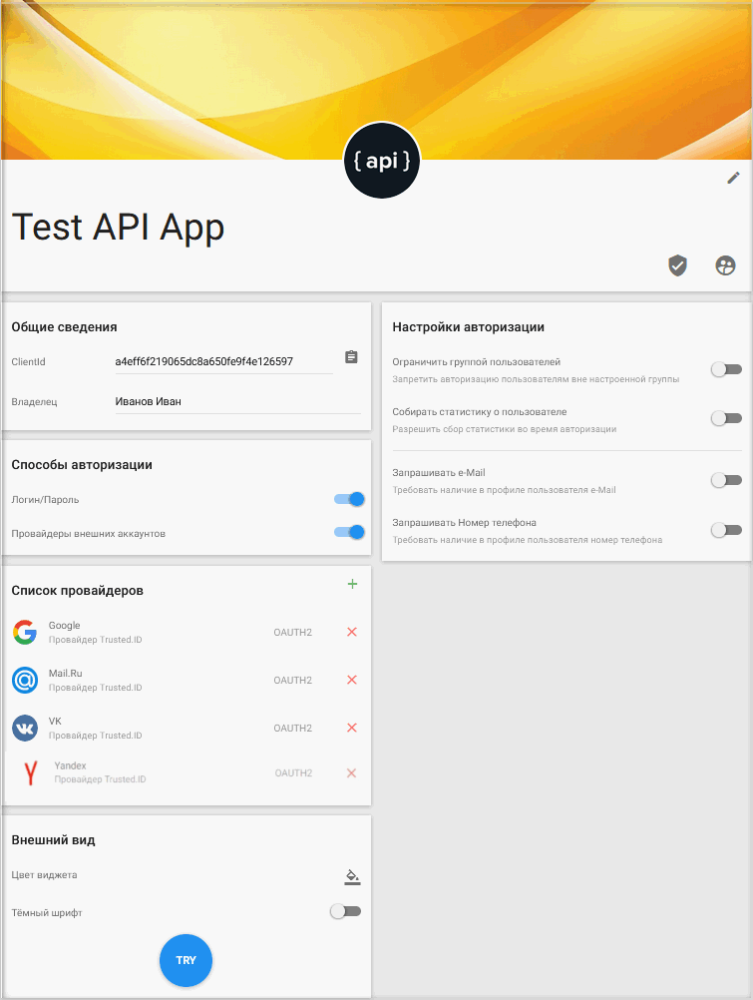
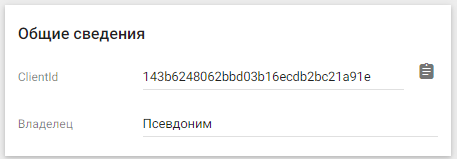
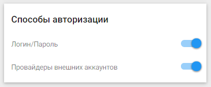
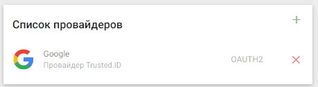
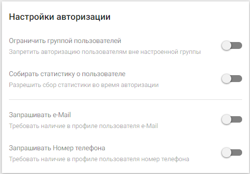
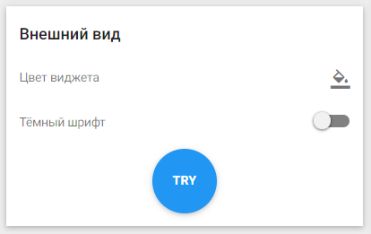
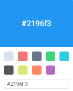
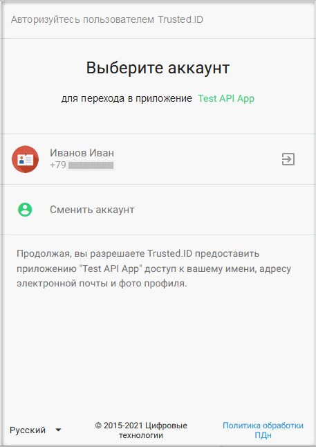
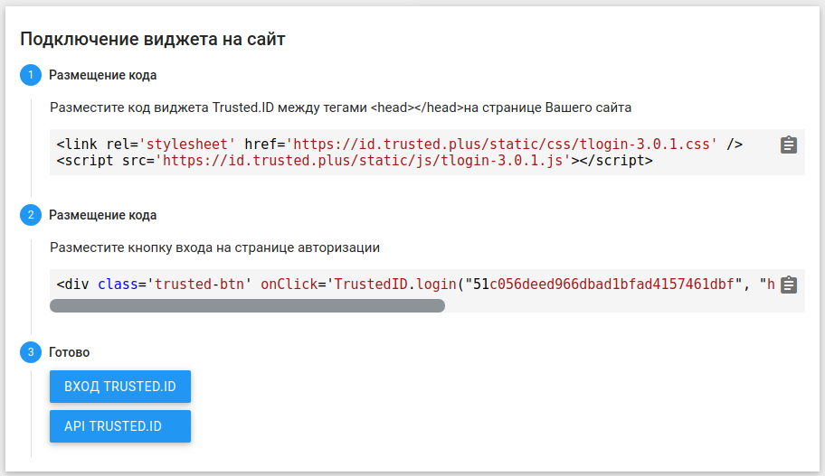

## Мои приложения
	
На данной вкладке отображаются приложения пользователя.

 

Приложение — это точка авторизации в информационную систему, в которую предоставляется доступ с помощью сервиса Trusted.Net.

Приложение позволяет:  
- настроить разные способы авторизации;
- контролировать доступ;
- устанавливать обязательность наличия у пользователя индентификационных данных.

Пользователь может быть как владельцем приложения, создав его самостоятельно, так и приглашенным в него администратором, имеющим полномочия менять настройки приложения. Во втором случае приложение автоматически отобразится на данной вкладке после согласия пользователя на участие в группе администраторов.

В сервисе поддерживаются несколько типов приложений:  
- КриптоАРМ Документы;
- API;
- BITRIX. 
  
Настройки для разных типов приложений имеют свои особенности.

Приложения можно создавать, редактировать, удалять.

Для создания приложения нужно нажать кнопку добавления. 

 

А затем выбрать иконку с нужным типом приложения. 

Для редактирования настроек приложения необходимо осуществить одиночный щелчок мышью по строке с приложением. 

Для удаления приложения или изменения его параметров общего характера используется контестное меню, вызываемого по клику в правой части строки с названием приложения.

 

## Основное окно настроек приложения

Основное окно настроек приложения позволяет создателю/администратору приложения:

- получать общие сведения о приложении (ClientId, Владелец);
- регулировать способы авторизации;
- настраивать параметры авторизации;
- предъявлять определенные требования к идентификационным данным пользователей;
- настраивать внешний вид виджета авторизации приложения.

***Примечание:*** далее рассматривается редактирование настроек приложения на примере приложения типа API.

Изменить аватар приложения можно, нажав на стандартную иконку приложения и выбрав изображение в файловом менеджере.

В разделе **Общие сведения** отображается уникальный идентификатор (ClientId) приложения и данные владельца. 

В разделе **Способы авторизации** можно настроить способ авторизации для пользователей по логину-паролю и/или по внешним аккаунтам провайдеров.

 

Список доступных для авторизации в приложение провайдеров регулируется в разделе **Список провайдеров**.

Провайдеры добавляются и удаляются в данном блоке при помощи типовых интерфейсных кнопок **Добавить** и **Удалить**.

 

В разделе **Настройки авторизации** можно ограничить авторизацию пользователей кругом участников, определенных администраторами приложения, активировать опцию сбора статистики о пользователях и настроить запрос наличия идентификаторов для входа в профиле пользователя.

В разделе **Внешний вид**  можно изменить цветовую палитру окон виджета авторизации приложения, цвет шрифта в виджете.

 	
 

По кнопке **Try** можно посмотреть вид виджета с выбранными настройками.

В разделе **Подключение виджета на сайт** даны инструкции для подключения виджета приложения, кнопка эмуляции вызова окна виджета приложения на сайте и кнопка перехода к документации по API сервиса.

  

**ИНСТРУКЦИИ ПО ТЕМЕ:**

1. [Инструкция по созданию приложения.](https://docs.trusted.plus/04-v1.5/8-instructions/create-app)  
