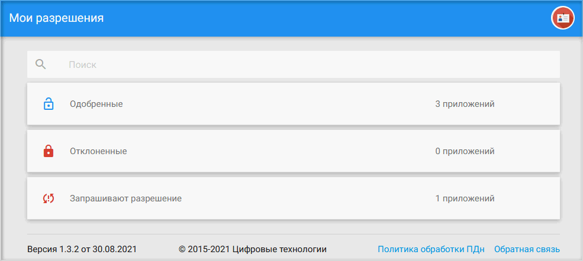
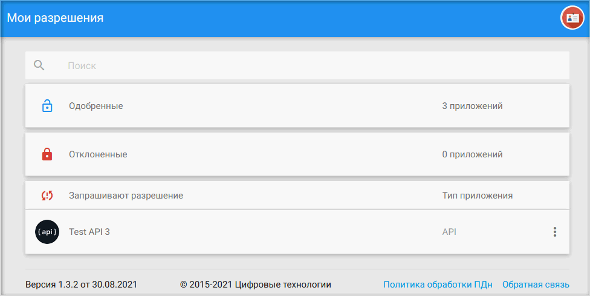
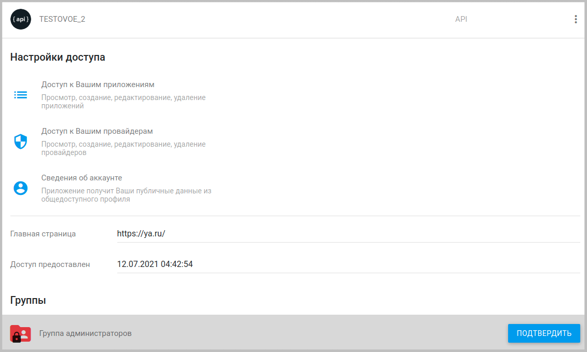
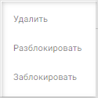
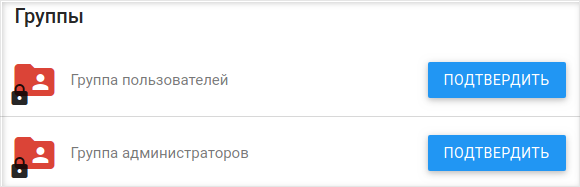
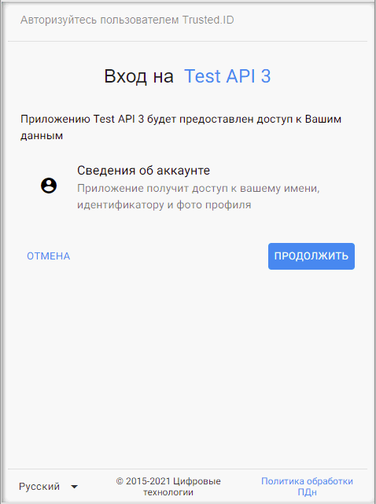
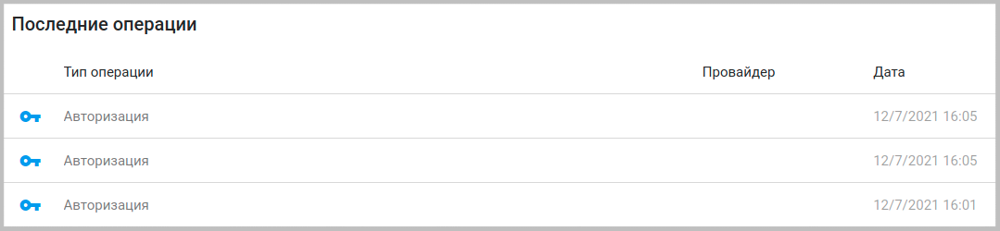

Данная вкладка служит для регулирования пользователем разрешений, требуемых разными приложениями.

Приложения разбиты на три категории: **Одобренные**, **Отклоненные** и **Запрашивают разрешение**. 

Для раскрытия категории достаточно произвести одиночный клик по соответствующему разрешению.

Когда администратор/владелец приложения отправляет запрос пользователю на участие в приложении, у пользователя данное приложение появляется в категории **Запрашивают разрешение**.

***Примечание:*** далее рассматривается интерфейс окна приложения, запрашивающего разрешения пользователя.

При клике по приложению отображается подробная информация. 

В разделе **Настройки доступа** отражаются разрешения, которые предлагается дать пользователю для данного приложения.

В поле **Главная страница** прописывается URL-адрес главной страницы сайта, на котором пользователь авторизуется.

В поле **Доступ предоставлен** содержится дата предоставления доступа к приложению.

Чтобы дать разрешение на запрашиваемые права или запретить приложению иметь определенные доступы, нужно воспользоваться контекстным меню. 

 

Для запрета на доступы нужно выбрать пункт меню **Заблокировать**, приложение переместится в категорию **Отклоненные**.
Для разрешения —  пункт **Разблокировать**, тогда приложение будет в категории **Одобренные**.  

При изменении администратором в приложении доступов приложение из **Одобренных** переместится в группу **Запрашивают разрешение**. 

Для аннулирования ранее выданных разрешений для приложения нужно перевести приложение из категории **Одобренные** в категорию **Отклоненные** через пункт контекстного меню **Заблокировать**.

Для возврата приложения в категорию одобренных используется пункт **Разблокировать**.

  

В разделе **Группы**  отображаются группы, в которые пользователь может вступить в качестве участника приложения.

Для вступления в группу участников приложения достаточно нажать на кнопку **Подтвердить**.

В некоторых случаях пользователь может авторизовываться в приложении (состоять в группе его пользователей), не давая соответствующих разрешений данному приложению, но, в большинстве случаев, при попытке авторизации в приложении, находящегося в категории **Отклоненные** или **Запрашивают разрешение**, пользователю придется давать необходимые разрешения в соответствующей форме.

В  разделе **Последние операции**  отражаются последние действия пользователя с указанием даты и времени. Данный раздел отображается, только если пользователь совершает действия в приложении.

Можно удалить приложение из любой категории на вкладке **Мои разрешения**, выбрав в контекстном меню пункт **Удалить**.

   

После удаления приложения все разрешения для пользователя аннулируются.  

Пользователь вновь может получить запрос на разрешения для приложения, если администратор вышлет его повторно.

Если пользователь не желает вновь видеть данное приложение в категории **Запрашивают разрешения**, то ему будет достаточно перевести его в категорию **Отклоненные**.

Удаление приложения из **Моих разрешений** также не означает его удаления из списка **Моих приложений**, если пользователь подтвердил свое участие на вступление в группу администраторов приложения. Аннулирование разрешений пользователя никак не влияет на возможность управлять приложением в качестве его администратора.
