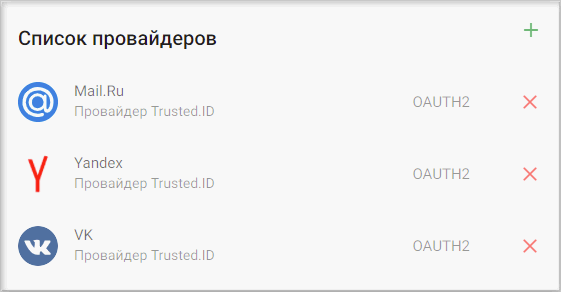

Чтобы настроить авторизацию через провайдер eVision.ID, у Вас должна быть учетная запись администратора в установленном eVision (подробнее ознакомиться с продуктом можно на сайте https://evision.tech/).

## Настройка провайдера для авторизации через eVision.ID

1. Зарегистрируйтесь и/или авторизуйтесь на сервисе, где развернута система Trusted.Net (далее рассматривается сервис [Trusted.ID](https://id.trusted.plus)).  
2. Создайте провайдер типа OAuth2.0.   
3. Авторизуйтесь как администратор в eVision.  
4. Перейдите в  **Меню** — **Учетные записи** — **Переключиться на приложения**.
.   
      
   
   
5.  Нажмите кнопку **Добавить приложение**.  
   
         

7. Напишите любое название приложения.
8. Сгенерируйте **Client Id**  и **Client Secret** в соответствующих полях формы добавления приложения. Скопируйте значения этих поле.

        

9.  В поле **Адрес переадресации** введите URL вида https://id.trusted.plus/idp/sso/authorize?provider_id=0771150db1610768fa402bc9a694b255&auth_type=OAUTH2,
      где provider_id — это значение поля ProviderId в настройках созданного провайдера OAuth2.0 на сервисе.        
        

      **Замените** домен на домен своего сайта.  
      **Сохраните** изменения.  
10.  Нажмите **Применить**.
    
11. Перейдите в настройки провайдера OAuth2.0 на сервисе.  
    
      

12. Вставьте скопированные значения **Client Id**  и **Client Secret** в соответствующие поля в настройках провайдера  и нажмите **Сохранить**.  
    
      

13. В настройках провайдера задайте параметры вида, заменив домен на домен вашей инсталляции eVision:   
      - user_authorization_uri — https://d.evision.tech/api/v1/EvisionApp/  
      - access_token_uri — https://d.evision.tech/api/v1/EvisionApp/Token  
      - user_info_uri — https://d.evision.tech/api/v1/EvisionApp/Profile  

      **Сохраните** изменения.    
        
 
14. В настройках провайдера установите флаг **Настройки приватности** как **Публичный**, если хотите, чтобы данный провайдер был доступен всем при настройке авторизации в приложение.  
    
       

##  Добавление созданного eVision.ID провайдера в приложение
   
1.  Выберите раздел **Мои приложения** в личном кабинете.
   
      

2. В списке приложений выберите приложение, в которое будет добавлена авторизация через eVision.ID провайдер.
   
      

3. В открывшемся окне настроек приложения в разделе **Список провайдеров** нажмите кнопку добавления нового провайдера.
     
   
       

4. Установите флаг напротив созданного провайдера в списке доступных провайдеров и нажмите кнопку **Сохранить**.
   
       

5. Список провайдеров приложения обновится, и в нем отразится добавленный провайдер.

      

6. В разделе **Способы авторизации** убедитесь, что переключатель **Провайдеры внешних аккаунтов** включен.

      

7. Теперь авторизация в приложение доступна через провайдер  eVision ID.
     
      

**ИНСТРУКЦИИ ПО ТЕМЕ:**  

1. [Инструкция по созданию приложения.](https://docs.trusted.plus/04-v1.5/8-instructions/create-app)  
2. [Как создать провайдер.](https://docs.trusted.plus/04-v1.5/5-providers/providers)  