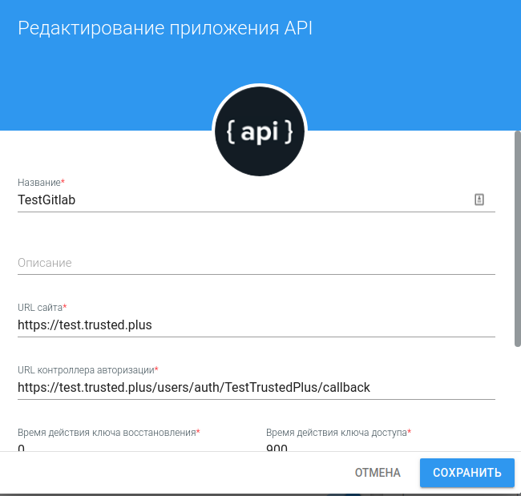
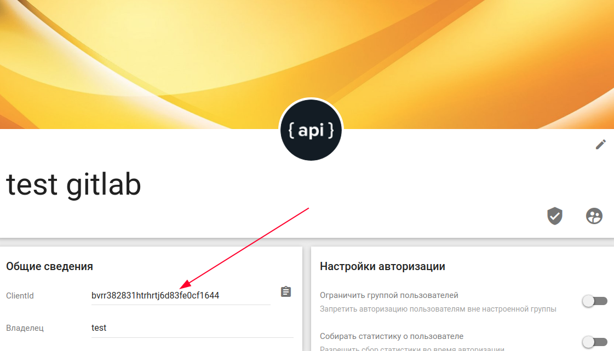
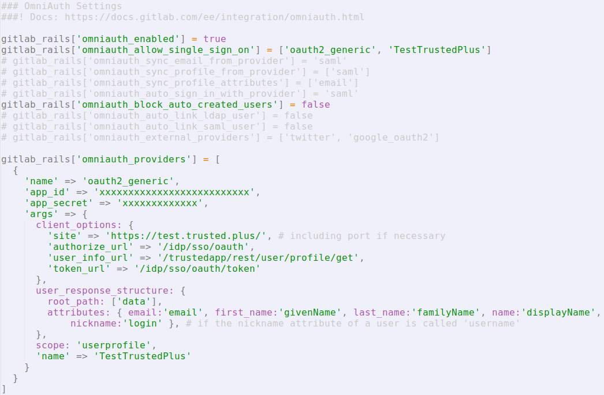
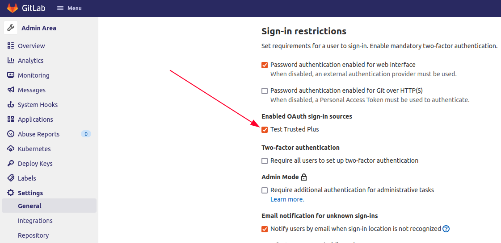

##  Создание приложения в сервисе Trusted.ID для авторизации в Gitlab
Для создания приложения пользователь должен быть зарегистрирован в сервисе, в данном случае в сервисе Trusted.ID. 

Для прохождения регистрации обратитесь к [инструкции](https://docs.trusted.plus/04-v1.5/2-authorization/registration).

Авторизуемся в сервисе Trusted.ID, переходим на вкладку **Мои приложения** и **добавляем** приложение типа **API**, иконка которого появляется в правом нижнем углу окна.

В открывшейся форме создания приложения заполняем поля следующим образом:
- **Название** — произвольное значение
- **URL сайта**  — https://<домен инсталляции gitlab>
- **URL контроллера авторизации** — https://<домен инсталляции gitlab>/users/auth/<НазваниеСервисаАвторизации>/callback

Также запоминаем сгенерированный пароль приложения или меняем его на свой.
Сохраняем данную форму и запоминаем присвоенный приложению clientid.

## Настройка авторизации Trusted.ID в gitlab
### Связывание приложения Trusted.ID с настройками gitlab

Настройка авторизации пользователей сервиса gitlab через Trusted.ID происходит в файле конфигурации gitlab gitlab.rb, расположенного в папке конфигурации сервиса (/config), часть настроек также расположена в административной части пользовательского интерфейса.

В файле конфигурации gitlab.rb переходим к блоку **OmniAuth Settings**.

Выставляем следующие значения для параметров, при необходимости, раскомментируя или добавляя их сами:
- gitlab_rails['omniauth_enabled'] = true
- gitlab_rails['omniauth_allow_single_sign_on'] = ['oauth2_generic', 'НазваниеСервисаАвторизации']
- gitlab_rails['omniauth_block_auto_created_users'] = false

Значение gitlab_rails['omniauth_providers'] должно выглядеть следующим образом:

gitlab_rails['omniauth_providers'] = [  
  {  
    'name' => 'oauth2_generic',  
    'app_id' => '<clientid приложения созданного в Trusted.ID>’',  
    'app_secret' => 'clientsecret приложения созданного в Trusted.ID',  
    'args' => {  
      client_options: {  
        'site' => 'https://<домен сервиса Trusted.ID>/',  
        'authorize_url' => '/idp/sso/oauth',  
        'user_info_url' => '/trustedapp/rest/user/profile/get',  
        'token_url' => '/idp/sso/oauth/token'  
      },  
      user_response_structure: {  
        root_path: ['data'],  
        attributes: { email:'email', first_name:'givenName', last_name:'familyName', name:'displayName', nickname:'login' },  
      },  
      scope: 'userprofile',  
      'name' => 'НазваниеСервисаАвторизации>’  
    }  
  }  
]  

Перезапускаем сервис gitlab для применения новых настроек и заходим под администратором в интерфейсную часть сервиса. Далее переходим в настройки по следующему пути: **Admin (Admin Area) — Settings-General**.

На открывшейся странице переходим к блоку **Sign-in restrictions** и проставляем флаг напротив **Названия Сервиса Авторизации** в дочернем блоке **Enabled OAuth sign-in sources**.

Убеждаемся, что на странице авторизации сервиса gitlab появилась возможность входа через Trusted.ID.

