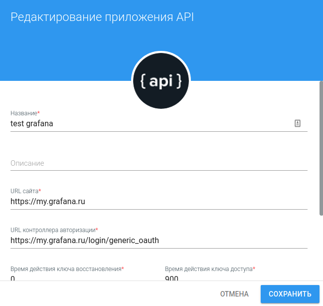
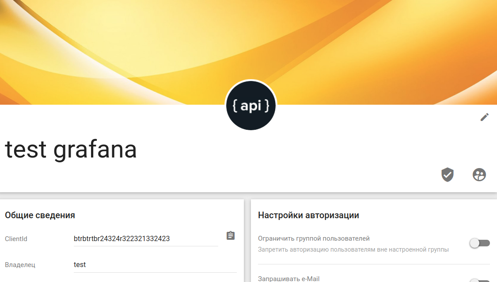
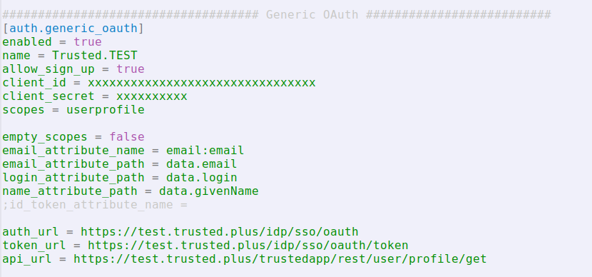

## Создание приложения в сервисе Trusted.ID для авторизации в Grafana
В открывшейся форме создания приложения заполняем поля следующим образом:
- **Название** — произвольное значение
- **URL сайта**  — https://<домен инсталляции grafana>
- **URL контроллера авторизации** — https://<домен инсталляции grafana>/login/generic_oauth

Также запоминаем сгенерированный пароль приложения или меняем его на свой.

Сохраняем данную форму и запоминаем присвоенный приложению clientid.

## Настройка авторизации Trusted.ID в grafana
### Связывание приложения Trusted.ID с настройками grafana
Настройка авторизации пользователей grafana через Trusted.ID происходит в файле конфигурации приложения grafana.ini. На linux-системах файл обычно расположен по пути: /etc/grafana/grafana.ini.

В файле конфигурации переходим к блоку **Generic OAuth**.

Выставляем следующие значения для параметров, при необходимости, раскомментируя или добавляя их сами:

[auth.generic_oauth]

enabled = true

name = Trusted.TEST

allow_sign_up = true

client_id = xxxxxxxxxxxxxxxxxxxxxxxxxxxxxxxxxxx

client_secret = xxxxxxxxxxx

scopes = userprofile

empty_scopes = false

email_attribute_name = email:email

email_attribute_path = data.email

login_attribute_path = data.login

name_attribute_path = data.givenName

auth_url = https://test.trusted.plus/idp/sso/oauth

token_url = https://test.trusted.plus/idp/sso/oauth/token

api_url = https://test.trusted.plus/trustedapp/rest/user/profile/get

Перезапускаем grafana для применения новых настроек и убеждаемся, что на странице авторизации появилась возможность входа через Trusted.ID.
