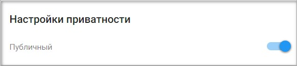

## Настройка провайдера для авторизации через Kloud ID

1. Зарегистрируйтесь и/или авторизуйтесь на сервисе, где развернута система Trusted Net (далее рассматривается сервис [TRUSTED.PLUS](https://id.trusted.plus)).  
2. Создайте провайдер типа OAuth2.0.   
3. Зарегистрируйтесь/авторизуйтесь в сервисе [id.kloud.one](https://id.kloud.one/).
4. Перейдите на вкладку **Приложения**.   
      
   
   
5.  Нажмите **Добавить**.  
   
         

6. Выберите OAUTH 2.
   
        

7. Напишите любое название приложения.
 
8.  В поле **Адрес авторизации в приложении (callback) для OAUTH 2** введите URL вида https://id.trusted.plus/idp/sso/authorize.   
**Замените** домен на домен своего сайта.   
        
11. Нажмите **Добавить**.
    
        

12. Скопируйте **Идентификатор приложения** и **Секретный ключ**.
    
13. Перейдите в настройки провайдера OAuth2.0 на сервисе Trusted.  
    
      

14. Вставьте скопированные значения **Идентификатор приложения** и **Секретный ключ** в соответствующие поля в настройках провайдера  и нажмите **Сохранить**.  
    
      

15. В настройках провайдера установите:   
      - user_authorization_uri — https://id.kloud.one/authorize  
      - access_token_uri — https://id.kloud.one/api/v1/token  
      - user_info_uri — https://id.kloud.one/api/v1/profile  

      **Сохраните** изменения.    
        
 
16. В настройках провайдера установите флаг **Настройки приватности** как **Публичный**, если хотите, чтобы данный провайдер был доступен всем при настройке авторизации в приложение.  
    
       

##  Добавление созданного Kloud ID провайдера в приложение
   
1.  Выберите раздел **Мои приложения** в личном кабинете.
   
      

2. В списке приложений выберите приложение, в которое будет добавлена авторизация через Kloud ID провайдер.
   
      

3. В открывшемся окне настроек приложения в разделе **Список провайдеров** нажмите кнопку добавления нового провайдера . 
   
       

4. Установите флаг напротив созданного провайдера в списке доступных провайдеров и нажмите кнопку **Сохранить**.
   
       

5. Список провайдеров приложения обновится, и в нем отразится добавленный провайдер.

      

6. В разделе **Способы авторизации** убедитесь, что переключатель **Провайдеры внешних аккаунтов** включен.

      

7. Теперь авторизация в приложение доступна через провайдер Kloud ID.
     
      

**ИНСТРУКЦИИ ПО ТЕМЕ:**  

1. [Инструкция по созданию приложения.](https://docs.trusted.plus/04-v1.5/8-instructions/create-app)  
2. [Как создать провайдер.](https://docs.trusted.plus/04-v1.5/5-providers/providers)  