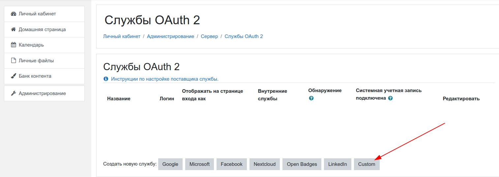
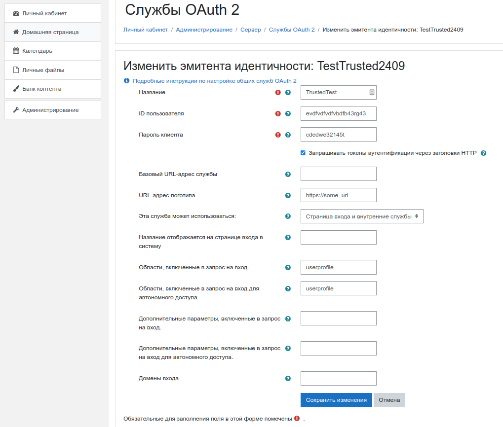

## Создание приложения в сервисе Trusted.ID для авторизации в moodle
Для создания приложения пользователь должен быть зарегистрирован в сервисе, в данном случае в сервисе Trusted.ID. 

Для прохождения регистрации обратитесь к [инструкции](https://docs.trusted.plus/04-v1.5/2-authorization/registration).

Авторизуемся в сервисе Trusted.ID, переходим на вкладку Мои приложения и добавляем приложение типа API, иконка которого появляется в правом нижнем углу окна.

В открывшейся форме создания приложения заполняем поля следующим образом:
- **Название** — произвольное значение
- **URL сайта**  — https://<домен инсталляции moodle>
- **URL контроллера авторизации** — https://<домен инсталляции moodle>/admin/oauth2callback.php

Также запоминаем сгенерированный пароль приложения или меняем его на свой.
Сохраняем данную форму и запоминаем присвоенный приложению clientid.

## Настройка авторизации Trusted.ID в moodle
### Связывание приложения Trusted.ID с настройками moodle

Для настройки авторизации пользователей сервиса потребуются права администратора в системе управления обучением moodle.

Заходим в инсталляцию moodle с административными правами и переходим в меню по следующему пути: **Администрирование — Плагины — Аутентификация**  и активируем плагин Oauth2 кликом по иконке в столбце **Включить**.

После этого переходим в раздел “Службы OAuth2” (**Администрирование — Сервер — Службы — OAuth2**) и выбираем создание кастомного провайдера, кликнув по кнопке **Custom**.

Откроется основное меню создания провайдера OAuth 2.0, в котором необходимо заполнить поля:
 - **Название** — отображаемое название сервиса авторизации (задается произвольно);
- **ID пользователя** — clientid приложения, созданного в сервисе Trusted.ID;
- **Пароль клиента** — clientsecret приложения, созданного в сервисе Trusted.ID;
- **URL-адрес логотипа** — путь к желаемому логотипу, которое будет отображаться рядом с “названием” (см. поле выше);
- **Эта служба может использоваться** — “Страница входа и справочные службы”;
- **Области, включенные в запрос на вход** — проставить значение “userprofile” (без кавычек);
- **Области, включенные в запрос на вход для автономного доступа** — проставить значение “userprofile” (без кавычек);

и  **сохранить** изменения.

Система вернет администратора на окно со списком OAuth 2 провайдеров. Для продолжения настройки осуществляем клик по иконке эндпойнтов в строке с только что созданным провайдером.

Эндпойнты представляют из себя связанную пару по типу: ключ-значение. В открывшемся окне последовательно добавляем три эндпойнта для провайдера путем нажатия кнопки “Создать новую конечную точку…”, где в качестве ключа выступает название эндпойнта, а значением — URL
- authorization_endpoint — https://<домен сервиса авторизации>/idp/sso/oauth
- token_endpoint — https://<домен сервиса авторизации>/idp/sso/oauth/token
- userinfo_endpoint — https:/<домен сервиса авторизации>/trustedapp/rest/user/profile/fullinfo

Следующим этапом добавляем сопоставления полей пользователей между сервисом авторизации и moodle (маппинги).

Маппинги представлены парами, их цель, в данном случае, связать поля пользователя Trusted.ID и поля системы управления обучением.

**Имя внешнего поля** — это имя поля в JSON-файле, передаваемом сервисом авторизации.
**Имя внутреннего поля** — это имя поля пользователя в moodle. Значение внутреннего поля выбирается из предустановленных, в раскрывающемся поле-списке.

Кликаем по иконке настройки маппингов  и добавляем три сопоставления:

- **email — email;**
- **givenName — firstname;**
- **familyName — lastname;**

где второй элемент в паре — имя внутреннего поля.

В окне со списком OAuth 2 провайдеров убеждаемся, что провайдер активен:  иконка “глаза” не перечеркнута.

### Настройка отправки почты в moodle
Дальнейшие шаги описаны исходя из предположения, что администратор moodle только что развернул инсталляцию и настройки отправки почты еще не заполнены в системе управления обучением. 

При первом заходе пользователя через сервис Trusted.ID в moodle под него создается пользователь (при условии, что ранее пользователь с данным email отсутствовал в базе moodle) и для активации данного профиля отправляется письмо на email, указанный у пользователя Trusted.ID.

Для отправки писем в moodle необходимо заполнить несколько полей. Переходим в меню по пути **Администрирование — Сервер — Электронная почта — Настройка исходящей почты** и заполняем следующие поля:
- **SMTP-серверы** — в данном поле вводим полное имя smtp-сервера, включая порт через двоеточие;
- **Безопасность SMTP** — выбираем нужное значение из поля-списка;
- **Тип аутентификации SMTP** — выбираем нужное значение.

В случае выбора типа аутентификации LOGIN заполняем поля Логин SMTP и Пароль SMTP.

Поле Адрес для писем, не требующих ответа, рекомендуется заполнить во избежание потенциальных проблем при отправке писем.

### Примечания:
В случае, если пользователь уже был ранее создан в moodle и email данного пользователя совпадает с email в профиле Trusted.ID, то письмо также будет отправлено на почтовый ящик для связывания обоих профилей.

Отсутствие email в профиле Trusted.ID  приведет к невозможности авторизации в moodle, т.к. это поле является связующим для идентификации пользователя в системе.

Удаление ранее привязанного к moodle почтового ящика в Trusted.ID и добавление нового почтового ящика приведет к созданию нового пользователя в moodle.

_Удаление ранее привязанного к moodle почтового ящика и добавление нового почтового ящика с повторным добавлением ранее удаленного и связанного с moodle приведет также к созданию нового пользователя в moodle, т.к. связанный с системой дистанционного обучения почтовый ящик будет не на первом месте в системе Trusted.ID. При этом удаление “второго” почтового ящика приведет к авторизации в moodle, т.к. ранее удаленный и добавленный вернется на “первое” место в Trusted.ID._

