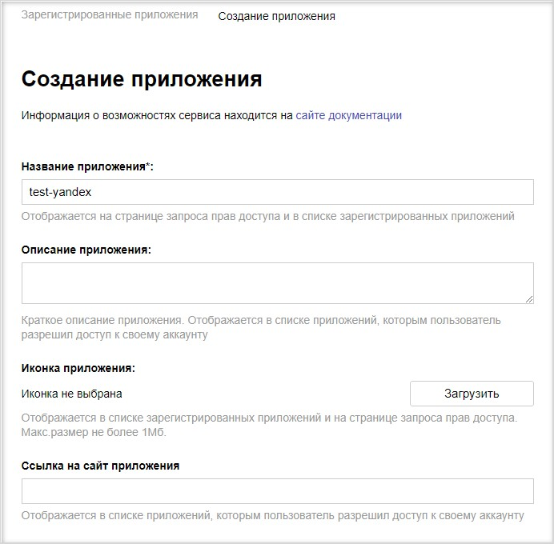
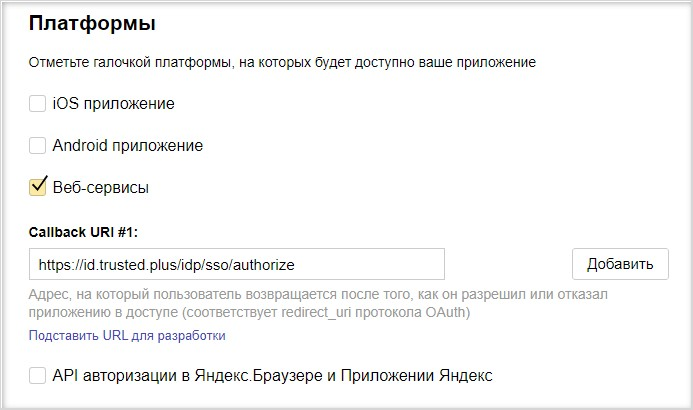
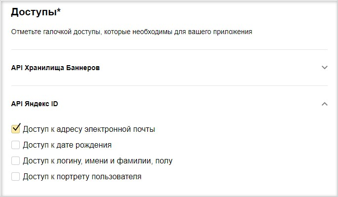
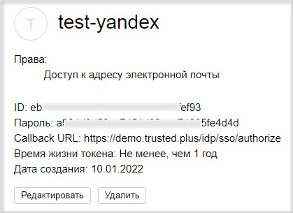
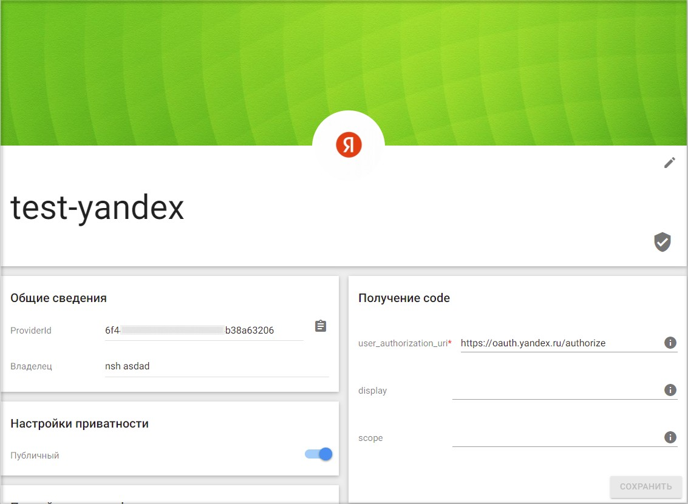
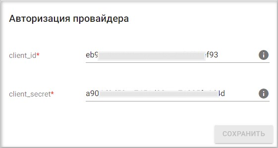
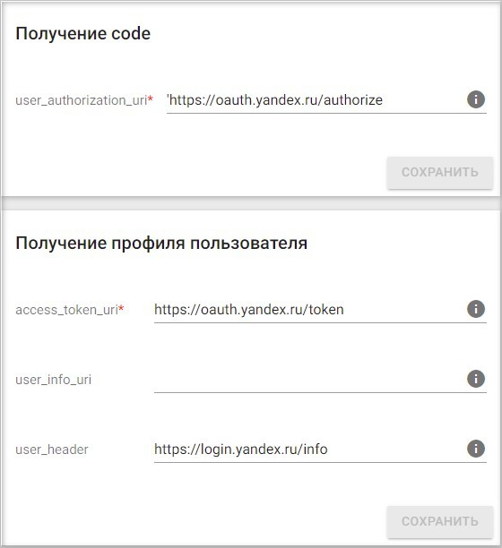
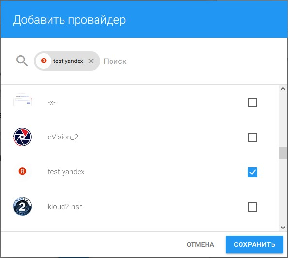
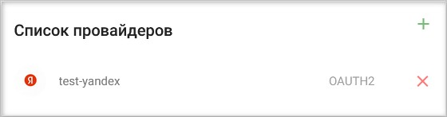
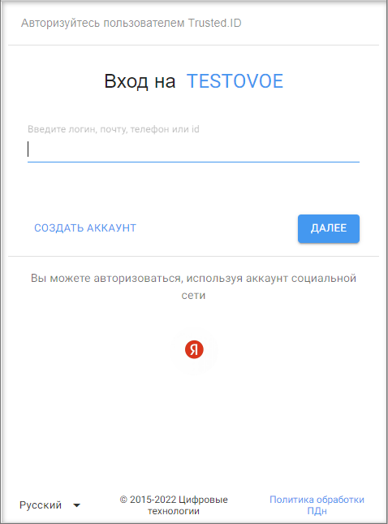

## Настройка провайдера для авторизации через Yandex

1. Зарегистрируйтесь и/или авторизуйтесь на сервисе, где развернута система Trusted Net (далее рассматривается сервис [TRUSTED.PLUS](https://id.trusted.plus)).  
2. Создайте провайдер типа OAuth2.0.  
3. Зарегистрируйтесь/авторизуйтесь в [Яндекс](https://passport.yandex.ru/registration/).  
4. Перейдите на страницу добавления приложения https://oauth.yandex.ru/client/new.  
       
   

5. Напишите любое название приложения.
6. В секции **Платформы** выберите **Веб-сервисы**. 
   В поле **Callback URL** впишите адрес вида https://id.trusted.plus/idp/sso/authorize. Замените домен на домен своего сайта.
   
     
 
7. Включите право доступа **API Яндекс ID** — **Доступ к адресу электронной почты**.
   
        

8. Создайте приложение.
9. Скопируйте значения **ID** и **Пароль**.  
   
      

10. Перейдите в настройки провайдера OAuth2.0 на сервисе Trusted.  
    
      

11. Вставьте скопированные значения **ID** и **Пароль** в соответствующие поля в настройках провайдера  и нажмите **Сохранить**.  
    
      

12. В настройках провайдера установите:  
    - user_authorization_uri — https://oauth.yandex.ru/authorize
    - access_token_uri — https://oauth.yandex.ru/token
    - user_info_uri — https://login.yandex.ru/info
  **Сохраните** изменения.  
    
    
 
13. В настройках провайдера установите флаг **Настройки приватности** как **Публичный**, если хотите, чтобы данный провайдер был доступен всем при настройке авторизации в приложение.  
    
       

##  Добавление созданного Yandex провайдера в приложение
   
1.  Выберите раздел **Мои приложения** в личном кабинете.
   
      

2. В списке приложений выберите приложение, в которое будет добавлена авторизация через Yandex провайдер.
   
      

3. В открывшемся окне настроек приложения в разделе **Список провайдеров** нажмите кнопку добавления нового провайдера.
    
   
       

4. Установите флаг напротив созданного провайдера в списке доступных провайдеров и нажмите кнопку **Сохранить**.
   
       

5. Список провайдеров приложения обновится, и в нем отразится добавленный провайдер.

      

6. В разделе **Способы авторизации** убедитесь, что переключатель **Провайдеры внешних аккаунтов** включен.

      

7. Теперь авторизация в приложение доступна через провайдер Yandex.
     
      

**ИНСТРУКЦИИ ПО ТЕМЕ:**  

1. [Инструкция по созданию приложения.](https://docs.trusted.plus/04-v1.5/8-instructions/create-app)  
2. [Как создать провайдер.](https://docs.trusted.plus/04-v1.5/5-providers/providers)  