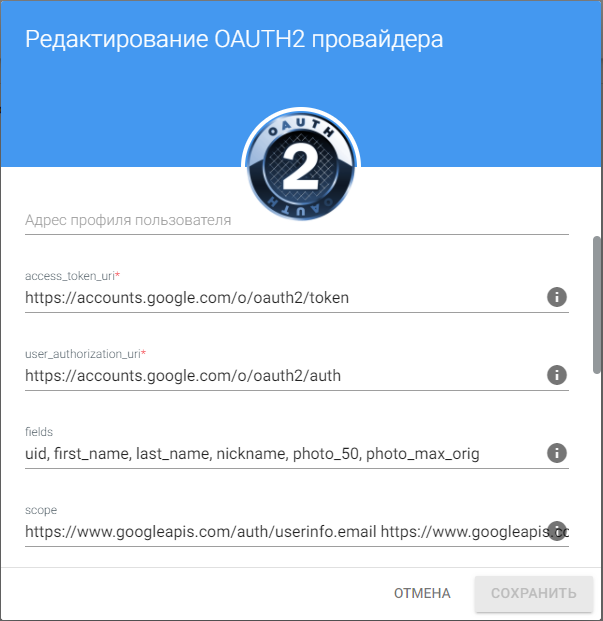

# Редактирование провайдера

## Редактирование описания провайдера

 Окно редактирования названия провайдера открывается по нажатию иконки редактирования, расположенной в верхней части основного окна настроек провайдера.

В открывшемся окне пользователь может изменить название провайдера, а также добавить его описание и адрес профиля пользователя.

## Редактирование настроек провайдера

Данное окно вызывается со вкладки **Мои провайдеры** через пункт контекстного меню действий с провайдером  **Изменить**. 

Данная форма содержит более ограниченный набор настроек провайдера в отличие от основного окна настроек (отсутствуют поля, содержащиеся в блоках **Общие сведения** и **Настройки приватности**), но на ней присутствуют поля, содержащиеся в форме редактирования наименования провайдера. 

