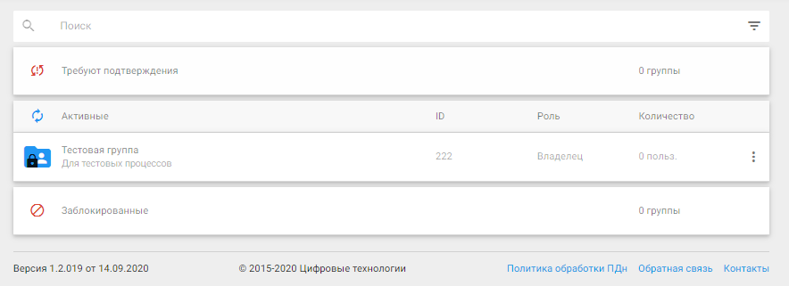
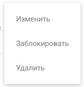
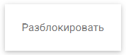

## Действия с пользователями и группами

Возможные действия с группами отличаются для разных типов групп.

Для осуществления действий используется контекстное меню действий с группой.

Если пользователь является владельцем (создателем) группы то он может:
- изменить название и описание группы;
- удалить группу.

Если пользователь является приглашенным участником группы то у него есть права:
- блокировать группу; 
- возвращать группу в статус активных.

Правом удалять пользователей из группы может:
- владелец (создатель) группы;
- пользователь, при условии, что он удаляет сам себя.
