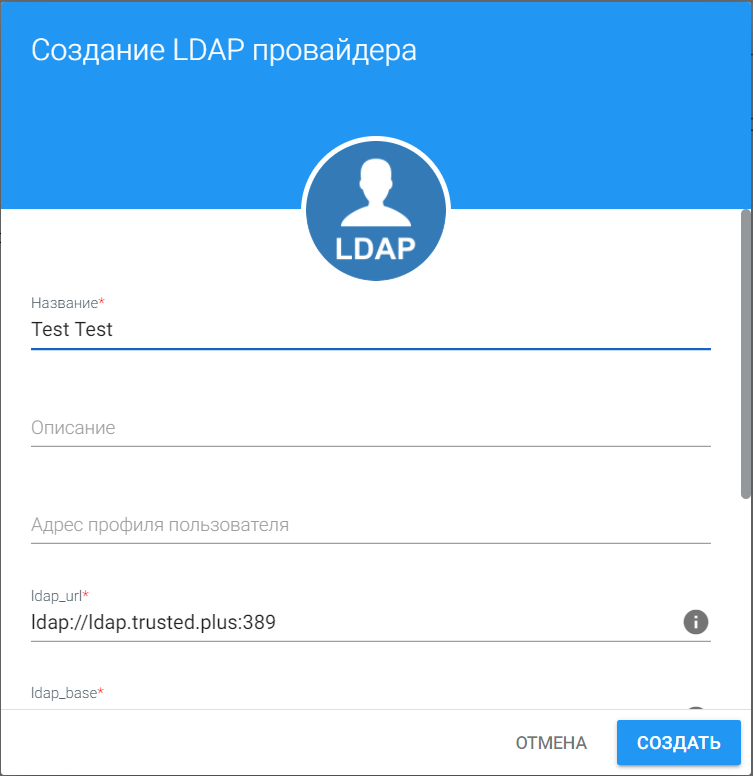
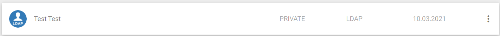
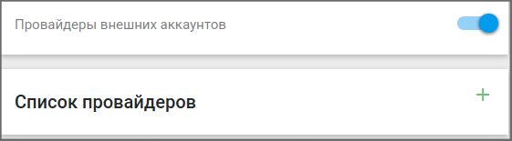
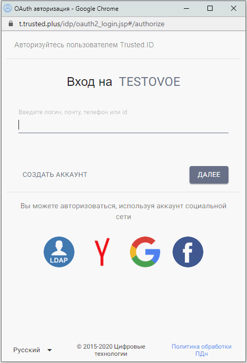
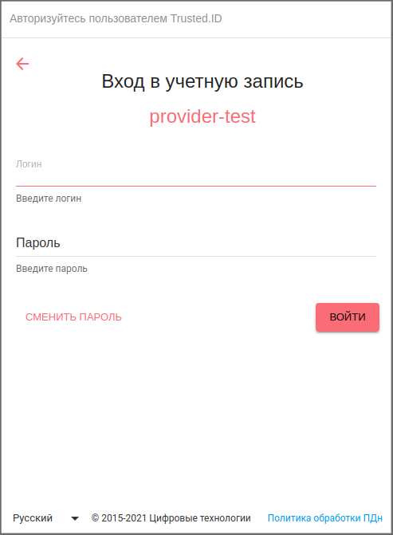

## LDAP

Провайдер LDAP предназначен для авторизации пользователя через настроенный Active Directory.
Что такое Active Directory?

***Active Directory*** - служба каталогов корпорации Microsoft, предназначена для хранения и организации объектов в сети в иерархическую защищенную логическую структуру, например пользователей, компьютеров или других физических ресурсов. 
Более подробно можно ознакомиться с следующих источниках:
* [Википедия](https://ru.wikipedia.org/wiki/Active_Directory)
* [1cloud](https://1cloud.ru/help/windows/struktura-hranilischa-active-directory)
----

## Инструкция по созданию провайдера LDAP

Прежде чем приступить к непосредственной работе с протоколом LDAP, нужно создать аккаунт/авторизоваться на сервисе [TRUSTED.PLUS](https://id.trusted.plus), и только после этого, перейти к созданию приложения, по следующим **шагам**:

## Шаг 1. Добавление провайдера типа LDAP

  1. В личном кабинете в меню пользователя кликните модуль ***"Мои провайдеры"***:
   
   
   
  2. Наведите курсор на кнопку **"+"** (добавление нового провайдера) в правом нижнем углу:
   
   

  3. Там появиться список разрешенных провайдеров, выберете ***LDAP***:
   
   

  4. Введите в поля ***Название, Описание*** - текст и числа и нажмите кнопку ***"Создать"***:
   
   
   
  провайдер сразу появиться в вашем списке:

   
----
## Шаг 2. Создание приложение типа API
  1. В личном кабинете в меню пользователя кликните модуль ***"Мои приложения"***:
   
   
  2. Наведите курсор на кнопку **"+"** (добавления нового приложения) в правом нижнем углу:
   
    
   
  3. Там появиться список разрешенных приложений, выберете ***API***:
   
   
   
  4. Введите в поля ***Название*** - текст и числа, ***URL сайта, URL контроллера авторизации*** - адрес вашего сайта в форме создания приложения и нажмите кнопку ***"Создать"***:
   
   приложение сразу появиться в вашем списке, далее кликаете по вкладке нового приложения:

   
   
  5. В открывшейся странице в ***"Способах авторизации"*** переключатель, в случаи отключения, измените на состояние "включить" в блоке *"Провайдеры внешних аккаунтов"*. То есть перевести переключатель из данного состояния:
   
  

   в это:

   

  Результат:

    
   
   Теперь переходите в пункт ***"Список провайдеров"***, нажимаете на кнопку **"+"** для добавления провайдера LDAP: 

    
   
   из списка:   

    

   Итог:

    

## Шаг 3. Откройте форму входа в приложении
  1. Переходите по **URL** вашего приложения, и выберете способ авторизации через [TRUSTED.PLUS](https://id.trusted.plus), и окажитесь на форме входа, где представлен провайдер ***LDAP***:
  
  

  2. После нажатия на иконку **LDAP**, переходите на форму входа, с помощью провайдера ***LDAP***:

  