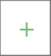

## LDAP

<!---->

Провайдер LDAP предназначен для авторизации пользователя через настроенный Active Directory.
Что такое Active Directory?

***Active Directory*** - служба каталогов корпорации Microsoft, предназначена для хранения и организации объектов в сети в иерархическую защищенную логическую структуру, например пользователей, компьютеров или других физических ресурсов. 
Более подробно можно ознакомиться с следующих источниках:
* [Википедия](https://ru.wikipedia.org/wiki/Active_Directory)
* [1cloud](https://1cloud.ru/help/windows/struktura-hranilischa-active-directory)
----

### Инструкция по созданию приложения LDAP

Прежде чем приступить к непосредственной работе с протоколом LDAP, нужно создать аккаунт/авторизоваться на сервисе [TRUSTED.PLUS](https://id.trusted.plus), и только после этого, перейти к созданию приложения, по следующим **шагам**:

1. [Добавление провайдера типа LDAP](#-шаг-1-добавить-провайдера-типа-ldap).
2. [Создание приложения API](#шаг-2-создать-приложение-типа-api).
3. [Добавление виджета входа в своем проекте](#шаг-3-добавить-виджет-логинации).

Рассмотрим каждый шаг по подробнее.

#### Шаг 1. Добавление провайдера типа LDAP
----
#### Шаг 2. Создание приложение типа API
  1. В личном кабинете в меню пользователя кликните модуль ***"Мои приложения"***:
   
   
<!---->
  2. Навести курсор на кнопку **"+"** (добавления нового приложения) в правом нижнем углу:
   
    
   <!---->
   
  3. Там появиться список разрешенных приложений, выбрать ***API***:
   
   
   <!---->
   
  4. Ввести в поля ***Название*** - текст и числа, ***URL сайта, URL контроллера авторизации*** - адрес вашего сайта в форме создания приложения и нажмите кнопку ***"Создать"***:
   
   <!---->
   оно сразу появиться в вашем списке, далее нажимаем на вкладку нового приложения:
   
   <!---->
   
  5. Находим пункты ***"Способ авториизации"*** и ***"Список провайдеров"*** в меню настройки виджета. В ***"Способах авторизации"*** проверяем активированность флажка ***"Провайдеры внешних аккаунтов"***, в случаи отключения - переключить: 
   
   
   <!---->

    
   <!---->
   
   Теперь переходим в пункт ***"Список провайдеров"***, нажимаем на кнопку **"+"** для добавления провайдера LDAP: 

    
   <!---->
   
   из списка:   

    
   <!---->

#### Шаг 3. Добавление виджет логинации

