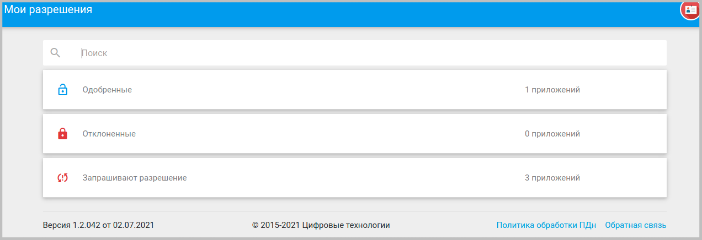
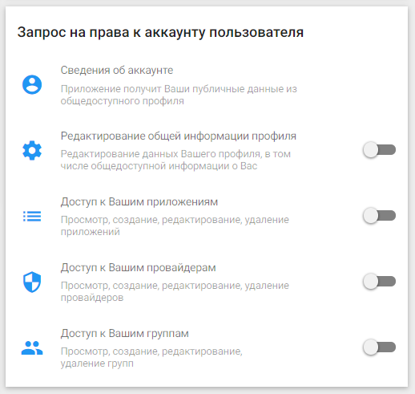
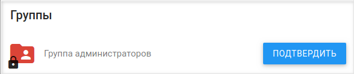
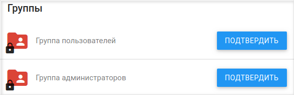
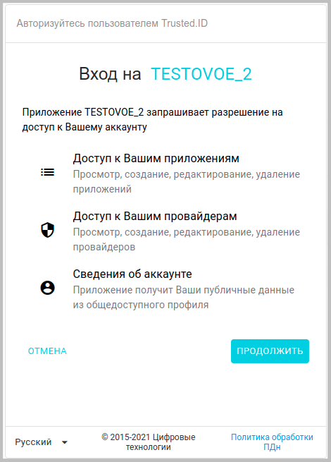
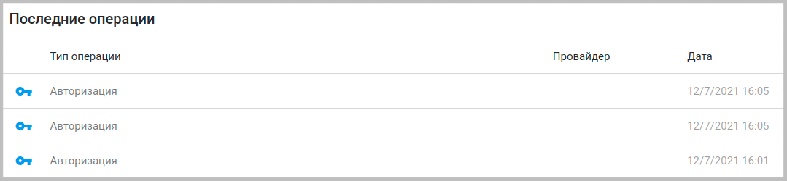

## Мои разрешения

Данная вкладка служит для установки либо запрета пользователем разрешений требуемых тем или иным приложением.

Основное окно вкладки разбито на три категории: **Одобренные**, **Отклоненные** и **Запрашивают разрешение**. 

Для раскрытия той или иной категории достаточно произвести одиночный клик по соответствующему разрешению данном окне.

Когда администратор/владелец приложения отправляет запрос пользователю на участие в приложении у пользователя данное приложение появляется в категории **Запрашивают разрешение**.

Для раскрытия окна приложения достаточно произвести клик по приложению в списке.

***Примечание:*** далее рассматривается интерфейс окна приложения, запрашивающего разрешения пользователя.

В верхней части окна расположен блок **Настройки доступа**. В данном блоке отражены разрешения, которые предлагается дать пользователю для данного приложения. Их список аналогичен активным разрешениям в блоке **Запрос на права к аккаунту пользователя**  в окне настроек приложения.

 
Также здесь располагается поле **Главная страница**. В этом поле прописывается url-адрес главной страницы сайта, на котором пользователь авторизуется посредством приложения.
В поле **Доступ предоставлен** содержится дата предоставления доступа к приложению.

Если пользователь желает дать свое разрешение на запрашиваемые права, либо напротив - запретить приложению иметь определенные доступы, ему следует воспользоваться контекстным меню действий в правом верхнем углу окна. При нажатии на кнопку контекстного меню действий в рассматриваемой форме происходит раскрытие контекстного меню. 

 

Для запрета на доступы в данном меню нужно выбрать пункт меню **Заблокировать**, а для разрешения -  пункт **Разблокировать**. В первом случае приложение переместится в категорию **Отклоненные**, во втором - в категорию **Одобренные**.
В случае, если в приложении администраторами позднее будут активированы переключатели на ранее не задействованные доступы, разрешения, на которые пользователь не давал согласие на момент перемещения приложения в категорию одобренных, то такое приложение вновь окажется у пользователя в группе **Запрашивают разрешение** с измененным списком в блоке **Настройки доступа**. 

В случае, если в какой-то момент времени пользователь решит аннулировать ранее выданные разрешения для приложения, то ему достаточно будет перевести приложение в категорию **Отклоненные** через пункт меню действий **Заблокировать**, доступный для приложений в категории **Одобренные**.
Для возврата приложения в категорию разрешенных используется пункт **Разблокировать**.

  

В нижней части окна приложения расположен блок **Группы**, в котором пользователю предлагается вступить в пользователи приложения. Для вступления в группу участников приложения достаточно нажать на кнопку **Подтвердить**. После этого данный блок примет следующий вид:

Если администратор приложения направил приглашение другому пользователю на участие в группе администраторов, то блок **Группы** может иметь следующий вид:

Если пользователю были направлены запрос и на участие как обычному пользователю приложения и как администратором, то в данном разделе указываются обе группы.

В некоторых случаях пользователь может авторизовываться через приложение (состоять в группе его пользователей), не давая соответствующих разрешений данному приложению, но в большинстве случаев при попытке авторизации через приложение, находящееся в категории **Отклоненные** либо **Запрашивают разрешение**, пользователю придется давать необходимые разрешения в соответствующей форме.

После того как пользователь начнет авторизовываться посредством приложения, в окне приложения появиться новый блок **Последние операции**, где будут отражаться последние действия пользователя с обязательным указанием даты и времени для каждого из таких действий.

Пользователь имеет возможность удалить приложение из любой категории на вкладке **Мои разрешения** через пункт **Удалить** контекстного меню действий. После удаления приложения из любой категории пользователь вновь может получить запрос на разрешения для такого приложения (оно снова появится в категории **Запрашивают разрешения**), если администратор вышлет его повторно, поскольку после удаления приложения все разрешения для пользователя автоматически аннулируются. Если пользователь не желает вновь видеть данное приложение в категории **Запрашивают разрешения**, то ему будет достаточно перевести его в категорию **Отклоненные**.
Удаление приложения из **Моих разрешений** также не означает его удаления из списка **Моих приложений** в случае если пользователю был выслан запрос на вступление в группу администраторов приложения, и он подтвердил в ней свое участие, т.к. аннулирование разрешений пользователя никак не влияет на возможность управлять приложением в качестве его администратора.
