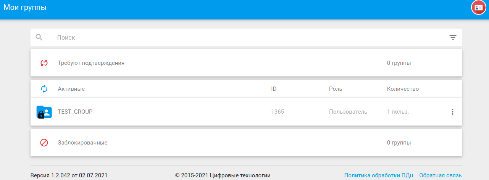
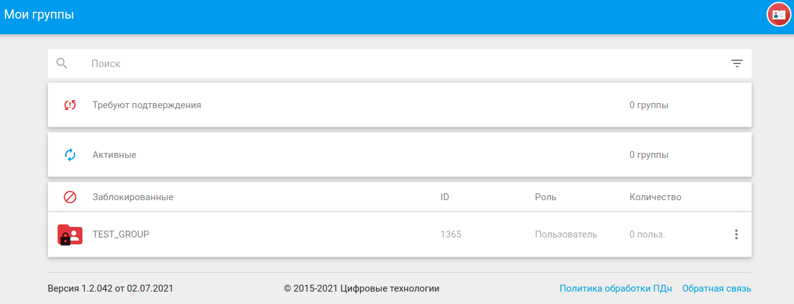
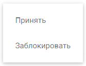

## Вступление в группу

После того как пользователю будет отправлено приглашение на вступление в группу, ее название появится в категории **Требуют подтверждения**, а в навигационной панели у вкладки **Мои группы** отобразится счетчик количества групп, требующих подтверждения.

Для принятия решения о вступлении в группу пользователь может нажать по названию группы в списке и во всплывающем модальном окне  выбрать кнопку **Принять**, либо кнопку **Отклонить**. 

В первом случае группа попадет в список активных:

  

во втором - в заблокированны:

К аналогичным результатам приводит использование контекстного меню действий с группой.

 

Когда пользователь принимает решение об отклонении запроса вступления в группу он исчезает из состава ее участников. Если пользователь решит разблокировать группу, в которую ему было выслано приглашение, то он появится в ее составе в категории **Активные пользователи**.
