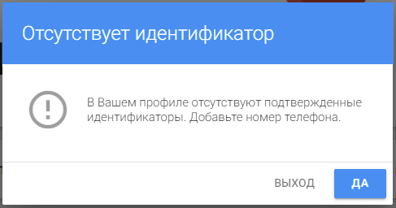
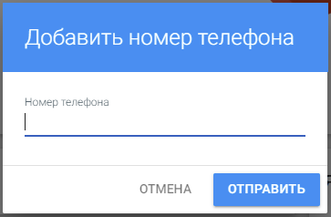
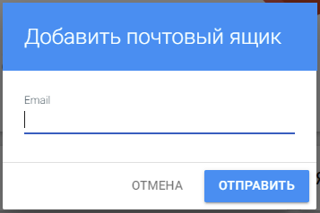

## Мой профиль
 
Вкладка, с которой начинается работа в сервисе, **Мой профиль**.

На данной вкладке пользователь может настроить способы авторизации в сервисе, менять персональные данные и пароль для авторизации.

Для настройки способов авторизации используются разделы: 
- Внешние аккаунты, 
- Ящики электронной почты, 
- Телефонные номера.

В каждом разделе присутствуют кнопки **Добавить** и **Удалить** длдя управления элементами.

 

Для работы с сервисом у пользователя обязательно должен быть добавлен один из обязательных идентификаторов - номер телефона или адрес электронной почты.  

Если ни один идентификатор не задан, то появляется информационное сообщение об этом с предложением добавить номер телефона.

По кнопке **Выход** происходит выход из сервиса. При последующей авторизации данное сообщение появится снова.

По кнопке **Да** открывается окно ввода номера телефона:

Далее необходимо ввести проверочный код, присылаемый СМС-уведомлением на телефон пользователя.

## Внешние аккаунты

В данном разделе пользователь может добавлять различные аккаунты для входа в сервис или приложение. 

Авторизация через внешние аккаунты позволяет пользователяю входить в приложение автоматически, без необходимости вводить логин и пароль, когда  пользователь уже авторизован в какой-либо социальной сети или сервисе (например, Yandex). Для входа будет достаточно  в виджете авторизации выбрать соответствующую иконку внешнего провайдера.  

При нажатии на кнопку добавлнения внешнего аккаунта открывается список с выбором доступных провайдеров, через которые пользователь сможет авторизовываться на сервисе.

При выборе провайдера открывается окно авторизации в выбранном сервисе. Далее пользователю следует авторизоваться.  
Шаг авторизации пропускается, если пользователь уже автоизован в социальной сети или в сервисе (например, в VK).
 
## Ящики электронной почты

В этом разделе  представлены адреса электронной почты пользователя. В профиль можно добавить неограниченное количество ящиков электронной почты.

 

 Для прикрепления почты к профилю достаточно выбрать кнопку добавления в данном разделе. В открывшемся окне необходимо ввести адрес электронной почты. 

 

Открывается форма  ввода проверочного кода, высылаемого на добавляемый почтовый ящик.

После введения проверочного кода, почтовый ящик добавляется в профиль. 

На добавляемый почтовый ящик приходит ссылка, при прохождении по которой, email автоматически добавляется в профиль. В этом случае введение проверочного кода не требуется, просто нажмите **Отмена** в окне подтверждения почтового ящика.  
В дальнейшем адрес электронной почты может быть использован для авторизации. 

## Телефонные номера

В этом разделе представлены номера телефонов пользователя. 

Пользователь может добавить в профиль неограниченное количество телефонных номеров путем нажатия на кнопку добавления.  
В открывшемся окне необходимо ввести номер телефона.

Для подтверждения необходимо ввести проверочный код, присылаемый СМС-уведомлением на телефон пользователя.

 
В дальнейшем номер телефона может быть использован для авторизации.
