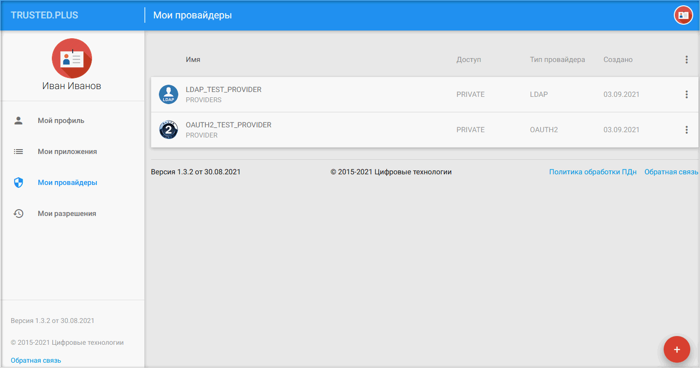
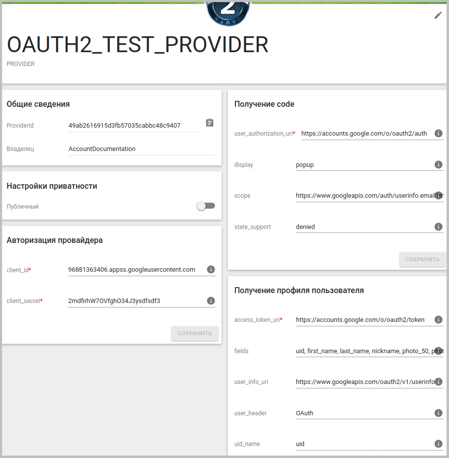
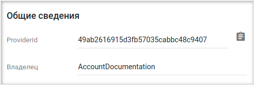
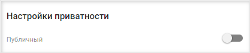
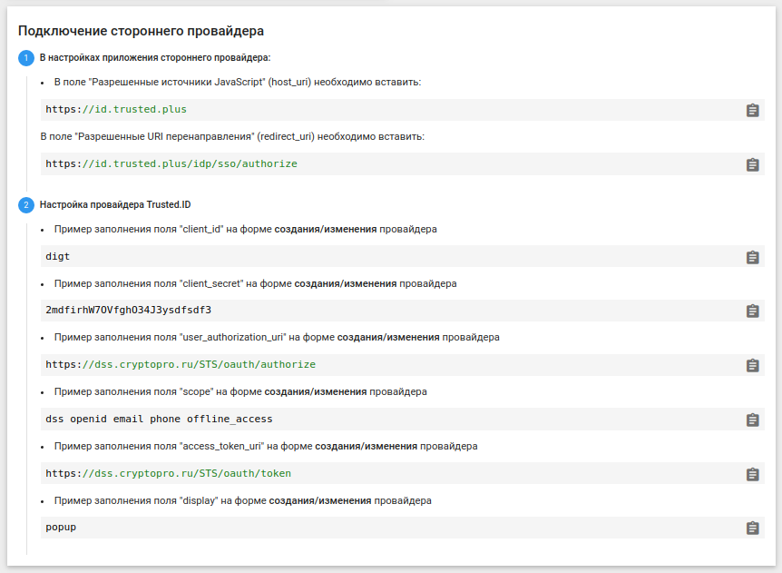

## Мои провайдеры

На вкладке **Мои провайдеры** отображаются созданные провайдеры.

Провайдеры используются в приложении для входа пользователей в информационную систему.  

В сервисе поддерживаются два типа провайдеров: LDAP, OAUTH2.

Для создания нового провайдера следует нажать на кнопку добавления (+) в правом нижнем углу формы и выбрать иконку с нужным типом провайдера. 

 

Для редактирования настроек провайдера необходимо осуществить одиночный щелчок мышью по строке с обозначением провайдера.
 
Для удаления провайдера или открытия формы с ограниченным набором его настроек можно воспользоваться меню действий.

 

## Основное окно настроек провайдера 

Основное окно настроек провайдера позволяет настраивать взаимодействие с сервисом  и регулировать возможность использования настроек провайдера в сторонних приложениях (не созданных пользователем).

***Примечание:*** далее рассматривается редактирование настроек на примере провайдера типа OAUTH2.

			
При нажатии на иконку можно изменить автар провайдера.  

В разделе **Общие сведения** содержится уникальный идентификатор провайдера (с возможностью скопировать в буфер обмена) и указывается его владелец.

В разделе **Настройки приватности** определяется будет ли данный провайдер доступен для использования при авторизации в приложение, создателем которого он не является. По умолчанию переключатель отвечающий за данную опцию находится в неактивном положении.

Поля в разделах **Авторизация провайдера**, **Получение code**, **Получение профиля пользователя** являются специализированными, их значения служат для взаимодействия с сервисом провайдера. Для правильного заполнения полей служат подсказки в соответсвующих полях и раздел с пояснениями.

  
 
**ИНСТРУКЦИИ ПО ТЕМЕ:**

1. [Создание LDAP провайдера и подключение в приложение для авторизации через провайдер.](https://v1.3/8-instructions/LDAP.md)  